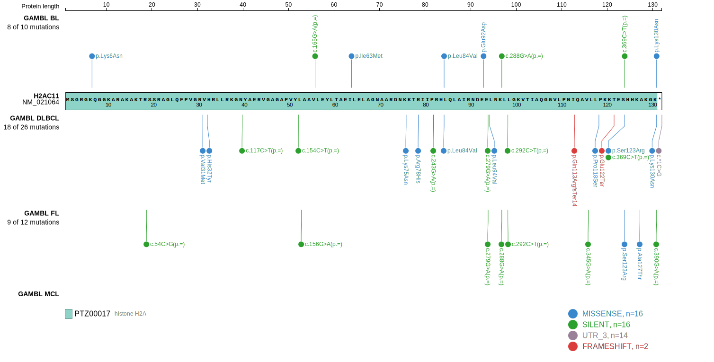
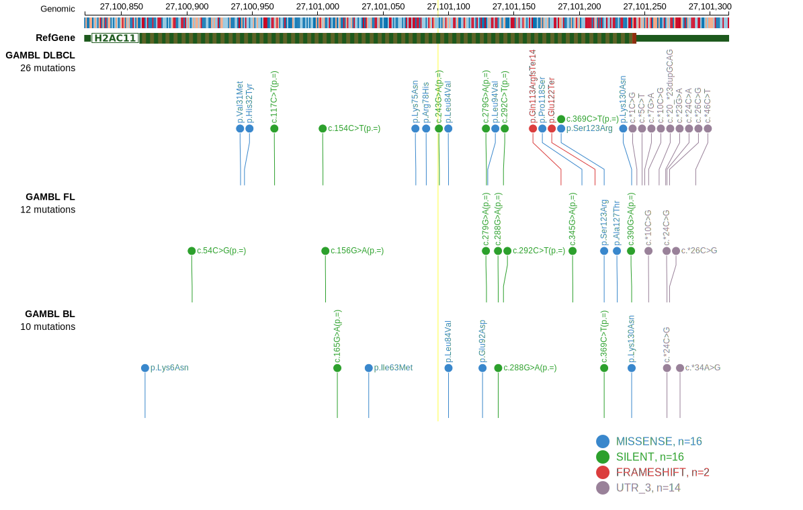

## Visualizations
### Protein
View coding variants in ProteinPaint [hg19](https://morinlab.github.io/LLMPP/GAMBL/HIST1H2AG_protein.html)  or [hg38](https://morinlab.github.io/LLMPP/GAMBL/HIST1H2AG_protein_hg38.html)

### Genome
View all variants in GenomePaint [hg19](https://morinlab.github.io/LLMPP/GAMBL/HIST1H2AG.html)  or [hg38](https://morinlab.github.io/LLMPP/GAMBL/HIST1H2AG_hg38.html)

<!-- ORIGIN: rossiCodingGenomeSplenic2012c -->
<!-- MZL: rossiCodingGenomeSplenic2012c -->
<!-- DLBCL: morinMutationalStructuralAnalysis2013 -->
<!-- BL: paneaWholeGenomeLandscape2019 -->
<!-- FL: krysiakRecurrentSomaticMutations2017b -->

## Representative Mutations

### BL4

&starf; &starf; &starf; &star; &star;

&starf; &star; &star; &star; &star;

&starf; &star; &star; &star; &star;

## All Mutations

### DLBCL[@morinMutationalStructuralAnalysis2013]

[RG130](https://www.bcgsc.ca/downloads/morinlab/GAMBL/Morin_2013/RG130.html)
[RG142](https://www.bcgsc.ca/downloads/morinlab/GAMBL/Morin_2013/RG142.html)

[[include:mermaid_HIST1H2AG.md]]

## References
