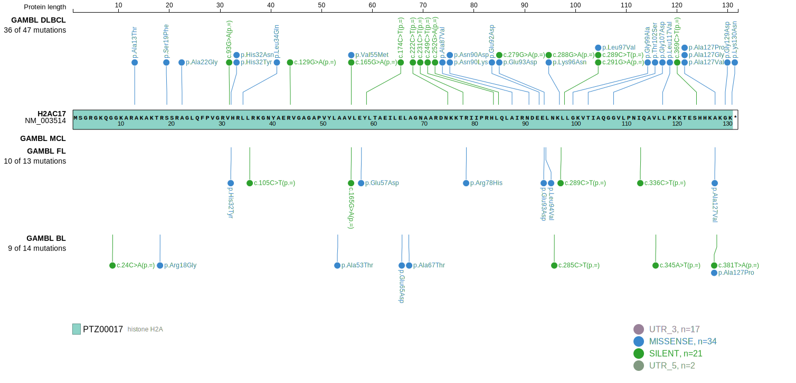

## Visualizations
### Protein
View coding variants in ProteinPaint [hg19](https://morinlab.github.io/LLMPP/GAMBL/HIST1H2AM_protein.html)  or [hg38](https://morinlab.github.io/LLMPP/GAMBL/HIST1H2AM_protein_hg38.html)

### Genome
View all variants in GenomePaint [hg19](https://morinlab.github.io/LLMPP/GAMBL/HIST1H2AM.html)  or [hg38](https://morinlab.github.io/LLMPP/GAMBL/HIST1H2AM_hg38.html)

<!-- ORIGIN: krysiakRecurrentSomaticMutations2017b -->
<!-- FL: krysiakRecurrentSomaticMutations2017b -->
<!-- BL: paneaWholeGenomeLandscape2019 -->

## Representative Mutations

### BL2

&star; &star; &star; &star; &star;

&star; &star; &star; &star; &star;

[[include:mermaid_HIST1H2AM.md]]

## References
