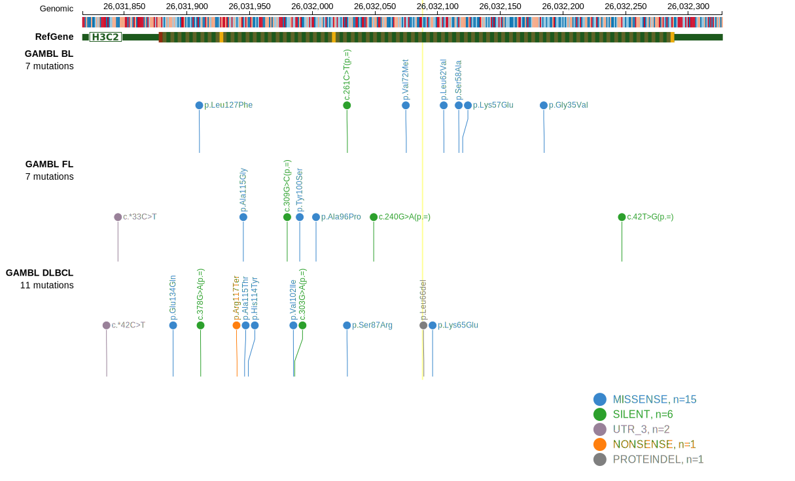

## Visualizations
### Protein
View coding variants in ProteinPaint [hg19](https://morinlab.github.io/LLMPP/GAMBL/HIST1H3B_protein.html)  or [hg38](https://morinlab.github.io/LLMPP/GAMBL/HIST1H3B_protein_hg38.html)

### Genome
View all variants in GenomePaint [hg19](https://morinlab.github.io/LLMPP/GAMBL/HIST1H3B.html)  or [hg38](https://morinlab.github.io/LLMPP/GAMBL/HIST1H3B_hg38.html)

<!-- ORIGIN: zhangGeneticHeterogeneityDiffuse2013 -->
<!-- DLBCL: zhangGeneticHeterogeneityDiffuse2013 -->
<!-- PMBL: reichelFlowSortingExome2015a -->

[[include:mermaid_HIST1H3B.md]]

## References
