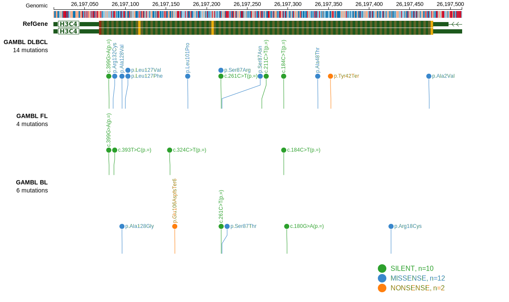
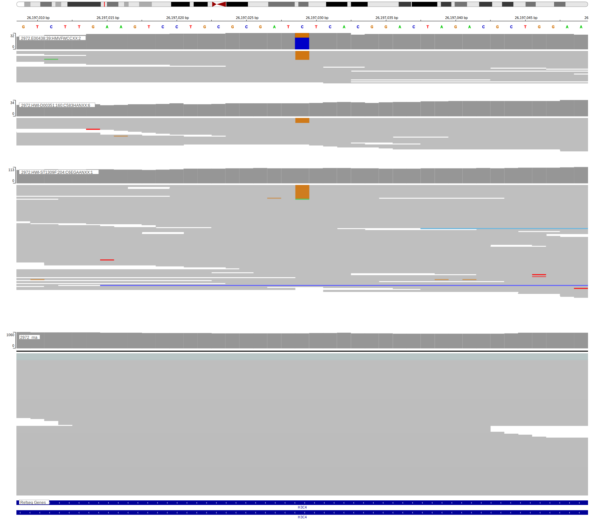

## Visualizations
### Protein
View coding variants in ProteinPaint [hg19](https://morinlab.github.io/LLMPP/GAMBL/HIST1H3D_protein.html)  or [hg38](https://morinlab.github.io/LLMPP/GAMBL/HIST1H3D_protein_hg38.html)

### Genome
View all variants in GenomePaint [hg19](https://morinlab.github.io/LLMPP/GAMBL/HIST1H3D.html)  or [hg38](https://morinlab.github.io/LLMPP/GAMBL/HIST1H3D_hg38.html)

<!-- ORIGIN: paneaWholeGenomeLandscape2019 -->
<!-- BL: paneaWholeGenomeLandscape2019 -->

## Representative Mutations

### BL1

**Rating**
&starf; &starf; &starf; &star; &star;

**Rating**
&starf; &starf; &starf; &star; &star;

[[include:mermaid_HIST1H3D.md]]

## References
