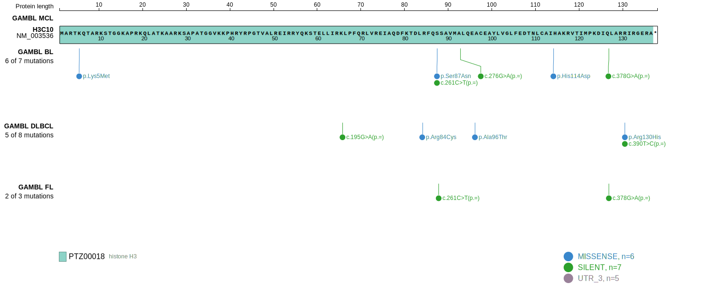
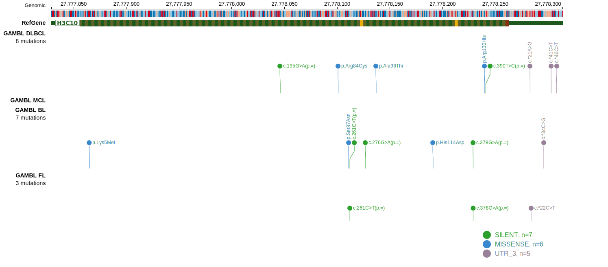
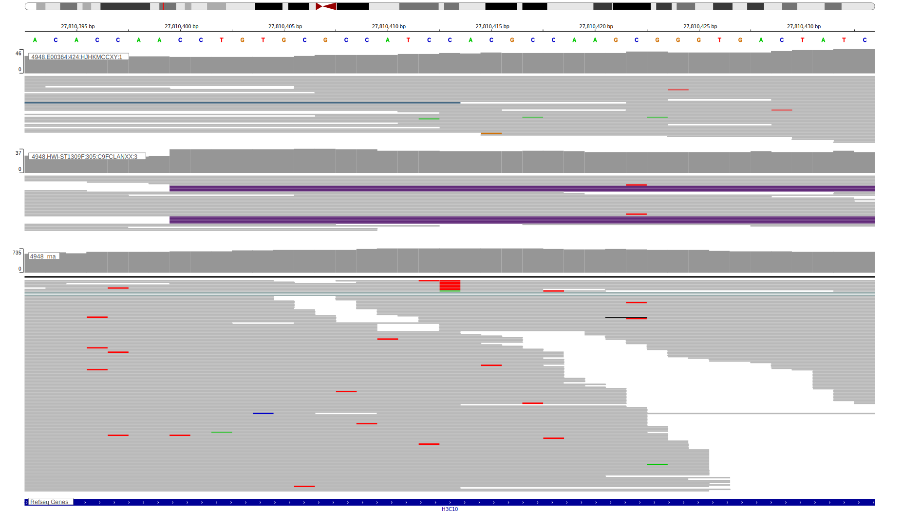
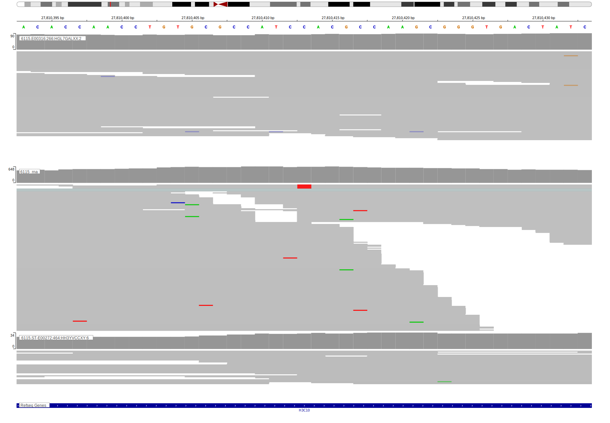

## Visualizations
### Protein
View coding variants in ProteinPaint [hg19](https://morinlab.github.io/LLMPP/GAMBL/HIST1H3H_protein.html)  or [hg38](https://morinlab.github.io/LLMPP/GAMBL/HIST1H3H_protein_hg38.html)

### Genome
View all variants in GenomePaint [hg19](https://morinlab.github.io/LLMPP/GAMBL/HIST1H3H.html)  or [hg38](https://morinlab.github.io/LLMPP/GAMBL/HIST1H3H_hg38.html)

## Representative Mutations

### BL2

**Rating**
&star; &star; &star; &star; &star;

**Rating**
&star; &star; &star; &star; &star;

