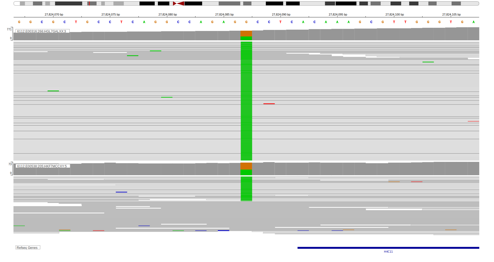

## Visualizations
### Protein
View coding variants in ProteinPaint [hg19](https://morinlab.github.io/LLMPP/GAMBL/HIST1H4J_protein.html)  or [hg38](https://morinlab.github.io/LLMPP/GAMBL/HIST1H4J_protein_hg38.html)

### Genome
View all variants in GenomePaint [hg19](https://morinlab.github.io/LLMPP/GAMBL/HIST1H4J.html)  or [hg38](https://morinlab.github.io/LLMPP/GAMBL/HIST1H4J_hg38.html)

## Representative Mutations

### BL2

**Rating**
&starf; &starf; &starf; &star; &star;

[[include:mermaid_HIST1H4J.md]]

## References

<!-- PMBL: mottokIntegrativeGenomicAnalysis2019b -->
<!-- ORIGIN: paneaWholeGenomeLandscape2019 -->
<!-- BL: paneaWholeGenomeLandscape2019 -->
<!-- BL: paneaWholeGenomeLandscape2019 -->
