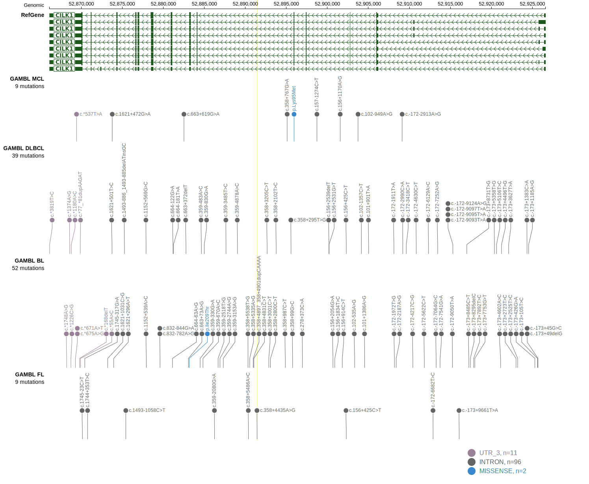

## Visualizations
### Protein
View coding variants in ProteinPaint [hg19](https://morinlab.github.io/LLMPP/GAMBL/ICK_protein.html)  or [hg38](https://morinlab.github.io/LLMPP/GAMBL/ICK_protein_hg38.html)

### Genome
View all variants in GenomePaint [hg19](https://morinlab.github.io/LLMPP/GAMBL/ICK.html)  or [hg38](https://morinlab.github.io/LLMPP/GAMBL/ICK_hg38.html)

<!-- ORIGIN: loveGeneticLandscapeMutations2012 -->
<!-- BL: loveGeneticLandscapeMutations2012 -->

## Representative Mutations

**Rating**
&starf; &star; &star; &star; &star;

## All Mutations

[1092](https://www.bcgsc.ca/downloads/morinlab/GAMBL/Love/1092_reports.html)
[516](https://www.bcgsc.ca/downloads/morinlab/GAMBL/Love/516_reports.html)

[[include:mermaid_ICK.md]]

## References
