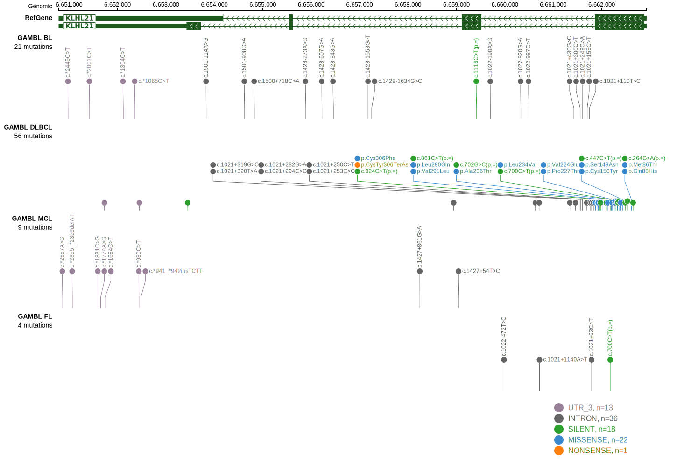

## Visualizations
### Protein
View coding variants in ProteinPaint [hg19](https://morinlab.github.io/LLMPP/GAMBL/KLHL21_protein.html)  or [hg38](https://morinlab.github.io/LLMPP/GAMBL/KLHL21_protein_hg38.html)

### Genome
View all variants in GenomePaint [hg19](https://morinlab.github.io/LLMPP/GAMBL/KLHL21.html)  or [hg38](https://morinlab.github.io/LLMPP/GAMBL/KLHL21_hg38.html)

