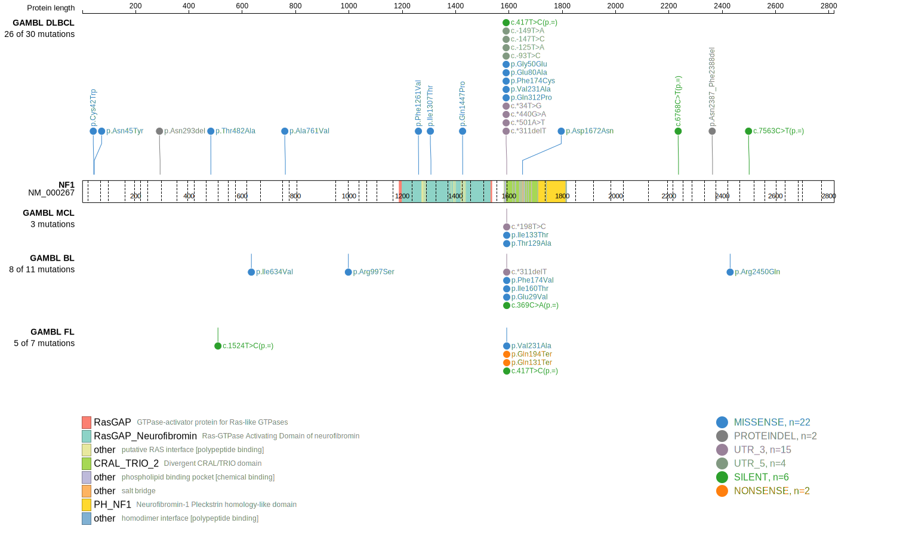

## Visualizations
### Protein
View coding variants in ProteinPaint [hg19](https://morinlab.github.io/LLMPP/GAMBL/NF1_protein.html)  or [hg38](https://morinlab.github.io/LLMPP/GAMBL/NF1_protein_hg38.html)

### Genome
View all variants in GenomePaint [hg19](https://morinlab.github.io/LLMPP/GAMBL/NF1.html)  or [hg38](https://morinlab.github.io/LLMPP/GAMBL/NF1_hg38.html)

