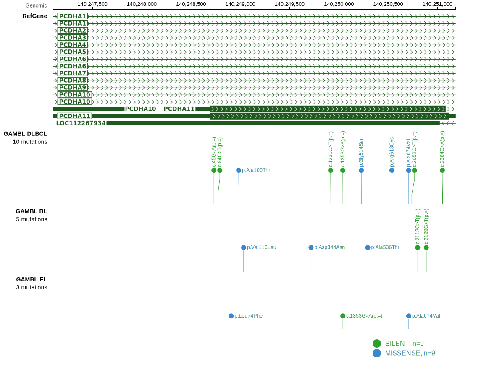

## Visualizations
### Protein
View coding variants in ProteinPaint [hg19](https://morinlab.github.io/LLMPP/GAMBL/PCDHA11_protein.html)  or [hg38](https://morinlab.github.io/LLMPP/GAMBL/PCDHA11_protein_hg38.html)

### Genome
View all variants in GenomePaint [hg19](https://morinlab.github.io/LLMPP/GAMBL/PCDHA11.html)  or [hg38](https://morinlab.github.io/LLMPP/GAMBL/PCDHA11_hg38.html)

