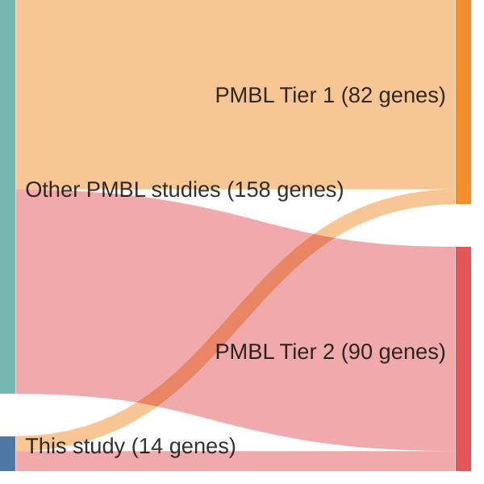

# @dunsCharacterizationDLBCLPMBL2021b
## Summary of novel genes

|Entity| Tier 1 genes| Tier 2 genes|
|:-:|:-:|:-:|
|DLBCL|8|3|
|PMBL|6|8|

## Novel genes reported in this study

|New gene|DLBCL tier|PMBL tier|
|:-|:-:|:-:|
|[BIRC3](BIRC3)|2 |2 |
|[CD83](CD83)|1 |1 |
|[CREBBP](CREBBP)|1 |1 |
|[DUSP2](DUSP2)|1 |1 |
|[FOXO1](FOXO1)|1 |2 |
|[HRNR](HRNR)| |2 |
|[IL4R](IL4R)|1 |1 |
|[LPHN3](LPHN3)| |2 |
|[MCL1](MCL1)|2 |2 |
|[MYC](MYC)|1 |2 |
|[PIM1](PIM1)|1 |1 |
|[RFTN1](RFTN1)|2 |2 |
|[SGK1](SGK1)|1 |1 |
|[WDR87](WDR87)| |2 |

# Details

