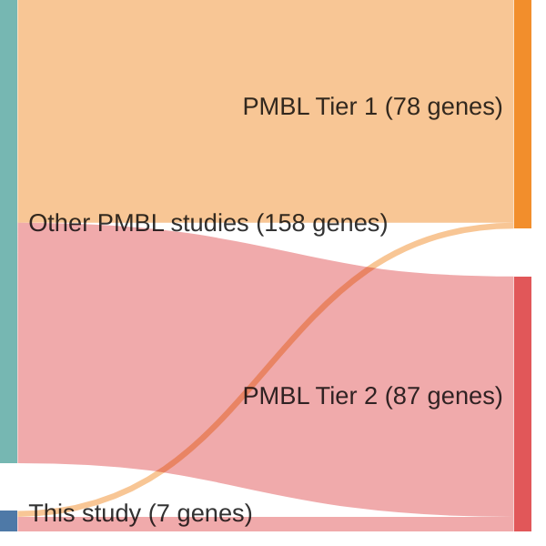

# @gomezUltraDeepSequencingReveals2023
## Summary of novel genes

|Entity| Tier 1 genes| Tier 2 genes|
|:-:|:-:|:-:|
|PMBL|2|5|

## Novel genes reported in this study

|New gene|PMBL tier|
|:-|:-:|
|[ARID5B](ARID5B)|1 |
|[AXDND1](AXDND1)|2 |
|[CDH5](CDH5)|2 |
|[DTX1](DTX1)|1 |
|[HLA-C](HLA-C)|2 |
|[LIMD2](LIMD2)|2 |
|[OR13C2](OR13C2)|2 |

# Details

