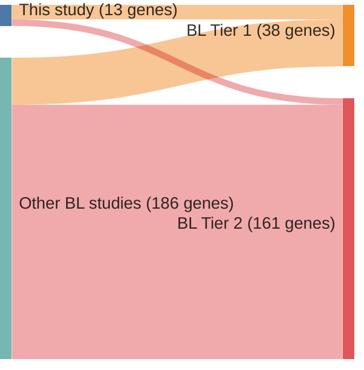

# @grandeGenomewideDiscoverySomatic2019
## Summary of novel genes

|Entity| Tier 1 genes| Tier 2 genes|
|:-:|:-:|:-:|
|BL|9|4|

## Novel genes reported in this study

|New gene|BL tier|
|:-|:-:|
|[BACH2](BACH2)|2 |
|[BCL7A](BCL7A)|1 |
|[CDKN2A](CDKN2A)|2 |
|[CHD8](CHD8)|1 |
|[GNAI2](GNAI2)|1 |
|[HIST1H1E](HIST1H1E)|2 |
|[KMT2D](KMT2D)|1 |
|[MIR142](MIR142)|2 |
|[RFX7](RFX7)|1 |
|[SIN3A](SIN3A)|1 |
|[TCL1A](TCL1A)|1 |
|[TFAP4](TFAP4)|1 |
|[USP7](USP7)|1 |

# Details

