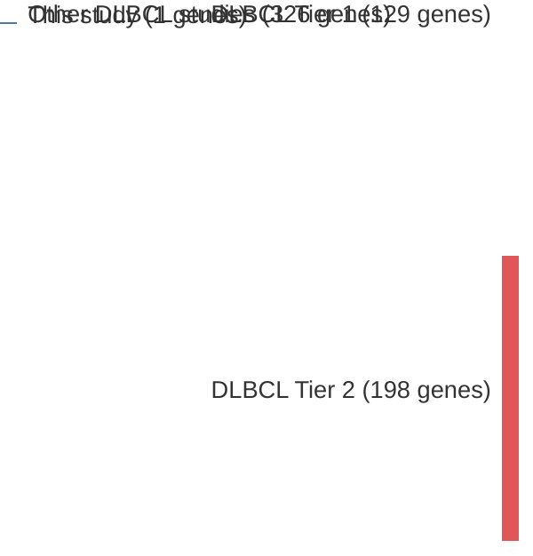

# @morinSomaticMutationsAltering2010a
## Summary of novel genes

|Entity| Tier 1 genes| Tier 2 genes|
|:-:|:-:|:-:|
|DLBCL|1||
|FL|1||

## Novel genes reported in this study

|New gene|DLBCL tier|FL tier|
|:-|:-:|:-:|
|[EZH2](EZH2)|1 |1 |

# Details

