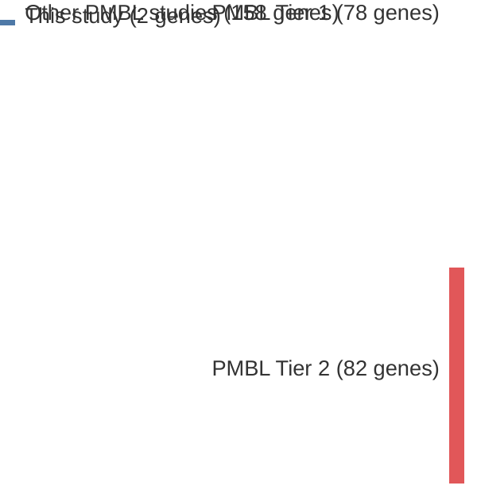

# @ottoGeneticLesionsTRAF32012a
## Summary of novel genes

|Entity| Tier 1 genes| Tier 2 genes|
|:-:|:-:|:-:|
|PMBL|2||

## Novel genes reported in this study

|New gene|PMBL tier|
|:-|:-:|
|[MAP3K14](MAP3K14)|1 |
|[TRAF3](TRAF3)|1 |

# Details

