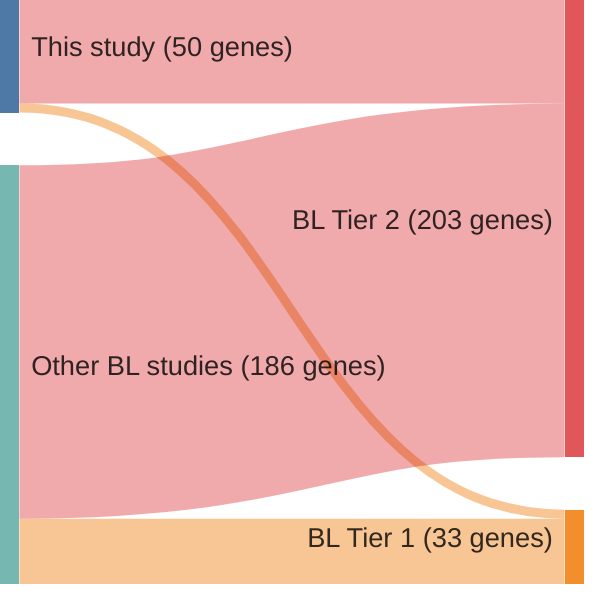

# @paneaWholeGenomeLandscape2019
## Summary of novel genes

|Entity| Tier 1 genes| Tier 2 genes|
|:-:|:-:|:-:|
|BL|4|46|

## Novel genes reported in this study

|New gene|BL tier|
|:-|:-:|
|[ALPK2](ALPK2)|2 |
|[BMP7](BMP7)|1 |
|[CARD11](CARD11)|2 |
|[CD79B](CD79B)|2 |
|[CD83](CD83)|2 |
|[CTCF](CTCF)|2 |
|[CXCR4](CXCR4)|2 |
|[DNMT1](DNMT1)|2 |
|[DTX1](DTX1)|2 |
|[EIF4A1](EIF4A1)|1 |
|[EP300](EP300)|2 |
|[EPPK1](EPPK1)|1 |
|[ETS1](ETS1)|2 |
|[FZD3](FZD3)|2 |
|[GRB2](GRB2)|2 |
|[HIST1H1C](HIST1H1C)|2 |
|[HIST1H2AG](HIST1H2AG)|2 |
|[HIST1H2AM](HIST1H2AM)|2 |
|[HIST1H2BK](HIST1H2BK)|2 |
|[HIST1H3D](HIST1H3D)|2 |
|[HIST1H3H](HIST1H3H)|2 |
|[HIST1H3I](HIST1H3I)|2 |
|[HIST1H3J](HIST1H3J)|2 |
|[HIST1H4J](HIST1H4J)|2 |
|[HNRNPU](HNRNPU)|1 |
|[IGLL5](IGLL5)|2 |
|[IKZF3](IKZF3)|2 |
|[IRF8](IRF8)|2 |
|[KCNK10](KCNK10)|2 |
|[KLHL6](KLHL6)|2 |
|[LTB](LTB)|2 |
|[MCL1](MCL1)|2 |
|[MME](MME)|2 |
|[MTOR](MTOR)|2 |
|[NOTCH2](NOTCH2)|2 |
|[PABPC4L](PABPC4L)|2 |
|[PCDHA11](PCDHA11)|2 |
|[PDZRN3](PDZRN3)|2 |
|[PIK3R1](PIK3R1)|2 |
|[PLCG2](PLCG2)|2 |
|[PXDNL](PXDNL)|2 |
|[RAC2](RAC2)|2 |
|[RNF144B](RNF144B)|2 |
|[SNTB2](SNTB2)|2 |
|[SP3](SP3)|2 |
|[SYNCRIP](SYNCRIP)|2 |
|[TET2](TET2)|2 |
|[WDR7](WDR7)|2 |
|[WNK2](WNK2)|2 |
|[ZFP36L1](ZFP36L1)|2 |

# Details

