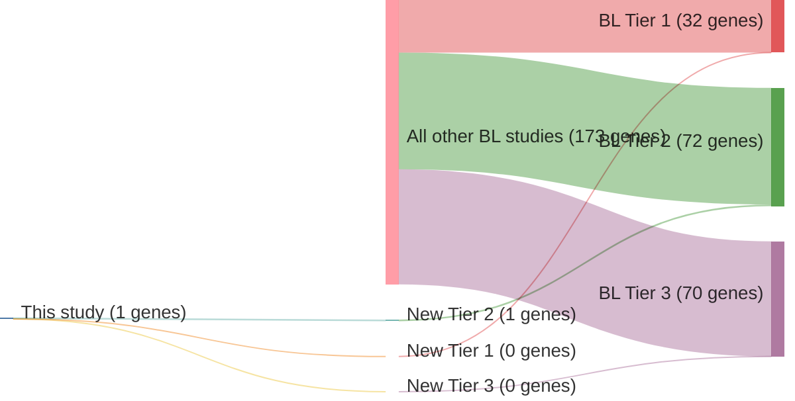

# @abateDistinctViralMutational2015
## Summary of novel genes

|Entity| Tier 1 genes| Tier 2 genes|Tier 3 genes|
|:-:|:-:|:-:|:-:|
|BL|0|1|0|

### Tier 2
|New gene|BL tier|
|:-|:-:|
|[CCNF](../CCNF)|2 |

# Details

