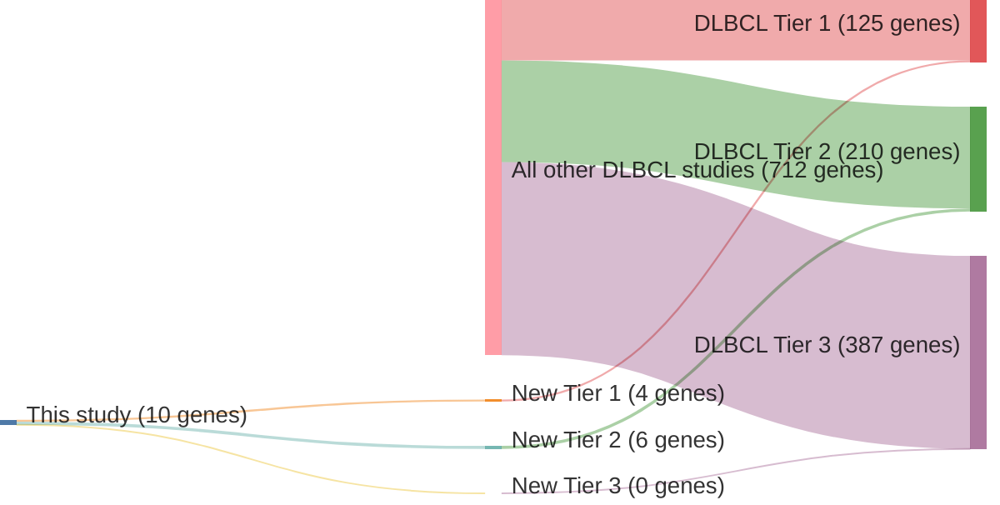

# @albuquerqueEnhancingKnowledgeDiscovery2017
## Summary of novel genes

|Entity| Tier 1 genes| Tier 2 genes|Tier 3 genes|
|:-:|:-:|:-:|:-:|
|DLBCL|4|6|0|

## Novel genes reported in this study

### Tier 1
|New gene|DLBCL tier|
|:-|:-:|
|[BTK](../BTK)|1 |
|[SETD1B](../SETD1B)|1 |
|[SPEN](../SPEN)|1 |
|[TET2](../TET2)|1 |

### Tier 2
|New gene|DLBCL tier|
|:-|:-:|
|[ASXL3](../ASXL3)|2 |
|[CEP164](../CEP164)|2 |
|[DNMT3B](../DNMT3B)|2 |
|[ERAP2](../ERAP2)|2 |
|[UBR5](../UBR5)|2 |
|[UHRF1BP1](../UHRF1BP1)|2 |

# Details

