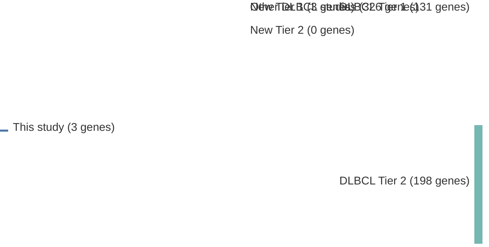

# @albuquerqueEnhancingKnowledgeDiscovery2017a
## Summary of novel genes

|Entity| Tier 1 genes| Tier 2 genes|
|:-:|:-:|:-:|
|DLBCL|3||

## Novel genes reported in this study

|New gene|DLBCL tier|
|:-|:-:|
|[BTK](BTK)|1 |
|[TET2](TET2)|1 |
|[TMSB4X](TMSB4X)|1 |

# Details

