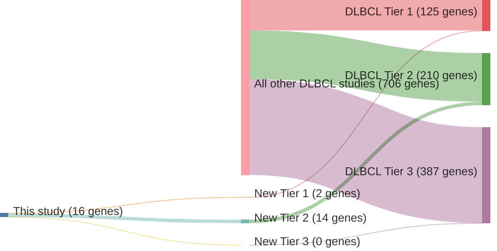

# @arthurGenomewideDiscoverySomatic2018
## Summary of novel genes

|Entity| Tier 1 genes| Tier 2 genes|Tier 3 genes|
|:-:|:-:|:-:|:-:|
|DLBCL|2|14|0|

## Novel genes reported in this study

### Tier 1
|New gene|DLBCL tier|
|:-|:-:|
|[FBXO11](../FBXO11)|1 |
|[RFX7](../RFX7)|1 |

### Tier 2
|New gene|DLBCL tier|
|:-|:-:|
|[AICDA](../AICDA)|2 |
|[BIRC3](../BIRC3)|2 |
|[CD44](../CD44)|2 |
|[CD74](../CD74)|2 |
|[LPP](../LPP)|2 |
|[MALAT1](../MALAT1)|2 |
|[NEAT1](../NEAT1)|2 |
|[RFTN1](../RFTN1)|2 |
|[RHEX](../RHEX)|2 |
|[SERPINA9](../SERPINA9)|2 |
|[ST6GAL1](../ST6GAL1)|2 |
|[TBC1D4](../TBC1D4)|2 |
|[USP7](../USP7)|2 |
|[ZCCHC7](../ZCCHC7)|2 |

# Details

