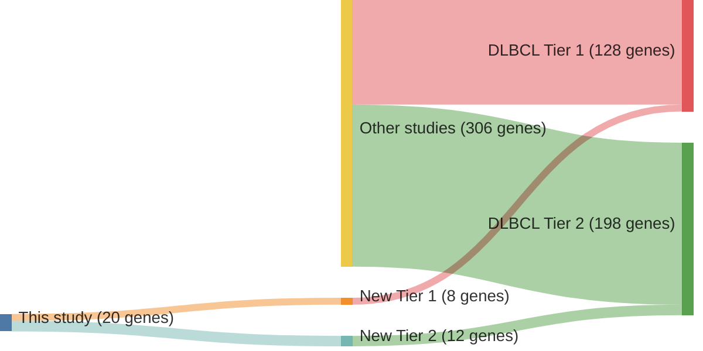

# @arthurGenomewideDiscoverySomatic2018
## Summary of novel genes

|Entity| Tier 1 genes| Tier 2 genes|
|:-:|:-:|:-:|
|DLBCL|8|12|

## Novel genes reported in this study

|New gene|DLBCL tier|
|:-|:-:|
|[AICDA](AICDA)|2 |
|[BCL7A](BCL7A)|1 |
|[BIRC3](BIRC3)|2 |
|[CD44](CD44)|2 |
|[CD74](CD74)|2 |
|[ETV6](ETV6)|1 |
|[GRHPR](GRHPR)|1 |
|[LCOR](LCOR)|1 |
|[LPP](LPP)|2 |
|[MALAT1](MALAT1)|2 |
|[MEF2C](MEF2C)|1 |
|[NEAT1](NEAT1)|2 |
|[OSBPL10](OSBPL10)|1 |
|[PIM2](PIM2)|1 |
|[RFTN1](RFTN1)|2 |
|[SERPINA9](SERPINA9)|2 |
|[ST6GAL1](ST6GAL1)|2 |
|[TBC1D4](TBC1D4)|2 |
|[ZC3H12A](ZC3H12A)|1 |
|[ZCCHC7](ZCCHC7)|2 |

# Details

