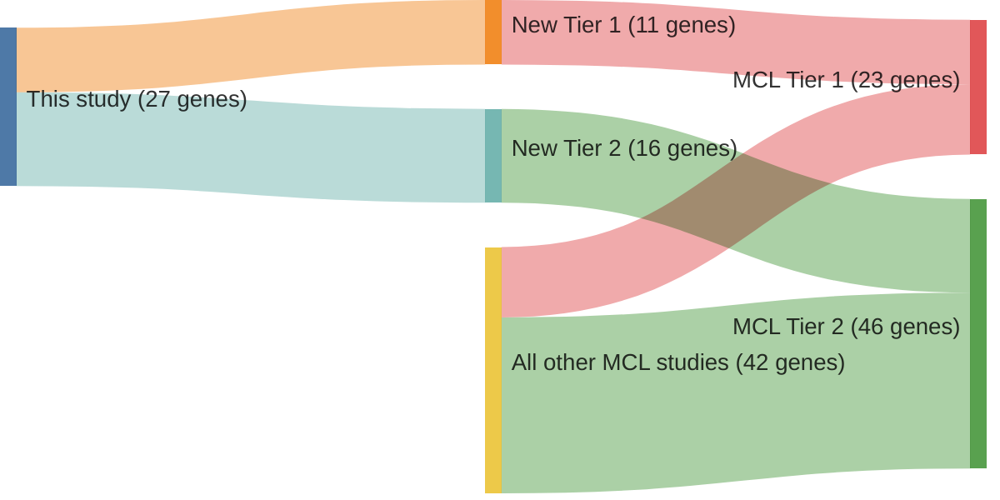

# @beaLandscapeSomaticMutations2013
## Summary of novel genes

|Entity| Tier 1 genes| Tier 2 genes|
|:-:|:-:|:-:|
|MCL|11|16|

## Novel genes reported in this study

### Tier 1
|New gene|MCL tier|
|:-|:-:|
|[ATM](../ATM)|1 |
|[BIRC3](../BIRC3)|1 |
|[CCND1](../CCND1)|1 |
|[KMT2D](../KMT2D)|1 |
|[MEF2B](../MEF2B)|1 |
|[NOTCH1](../NOTCH1)|1 |
|[NOTCH2](../NOTCH2)|1 |
|[NSD2](../NSD2)|1 |
|[SP140](../SP140)|1 |
|[TLR2](../TLR2)|1 |
|[TP53](../TP53)|1 |

### Tier 2
|New gene|MCL tier|
|:-|:-:|
|[ABCA3](../ABCA3)|2 |
|[ABCC9](../ABCC9)|2 |
|[CHMP4C](../CHMP4C)|2 |
|[CRYBG3](../CRYBG3)|2 |
|[DCP1B](../DCP1B)|2 |
|[DLGAP2](../DLGAP2)|2 |
|[DNAJC6](../DNAJC6)|2 |
|[KCNC2](../KCNC2)|2 |
|[KIAA1671](../KIAA1671)|2 |
|[LUZP4](../LUZP4)|2 |
|[PCSK2](../PCSK2)|2 |
|[PDLIM3](../PDLIM3)|2 |
|[RGS4](../RGS4)|2 |
|[SLC17A6](../SLC17A6)|2 |
|[TNRC6B](../TNRC6B)|2 |
|[TRPM6](../TRPM6)|2 |

# Details

