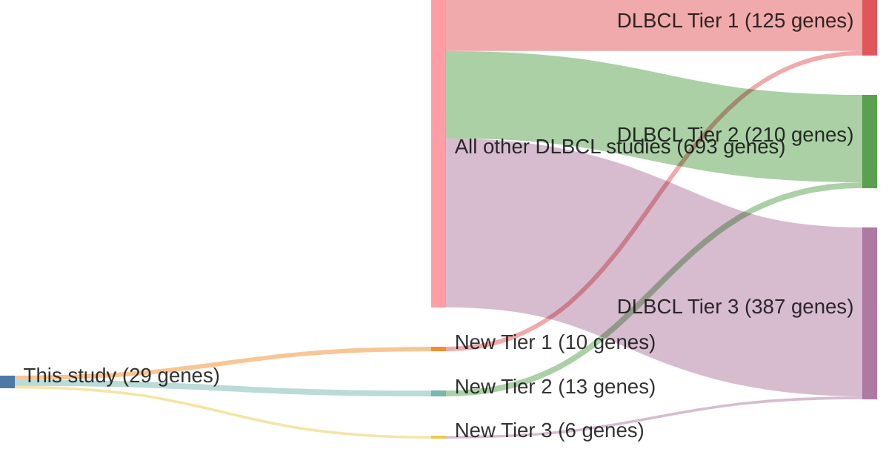

# @chapuyMolecularSubtypesDiffuse2018

## Study Overview
In their 2018 study published in *Nature Medicine*, Chapuy et al. conducted a comprehensive genetic analysis of 304 primary diffuse large B-cell lymphoma (DLBCL) samples. Through integrative analysis of somatic mutations, copy number alterations, and structural variants, they identified five distinct molecular subtypes of DLBCL, labeled **C1 through C5**, each characterized by unique genetic alterations and associated clinical outcomes.

## Key Findings

### Molecular Subtypes Identified
1. **C1 Subtype**:
   - Characterized by mutations in **NOTCH2** and **BCL6**.
   - Suggests an extrafollicular/marginal zone origin.

2. **C2 Subtype**:
   - Defined by biallelic inactivation of **TP53** and **CDKN2A** loss.
   - Associated with genomic instability.

3. **C3 Subtype**:
   - Enriched for **BCL2** translocations and mutations in chromatin modifiers such as **EZH2**.
   - Indicates a germinal center B-cell origin.

4. **C4 Subtype**:
   - Marked by mutations in **SGK1**, **BRAF**, and **STAT3**.
   - Associated with a favorable prognosis.

5. **C5 Subtype**:
   - Characterized by co-mutations in **MYD88** and **CD79B**.
   - Associated with chronic active B-cell receptor signaling.

### Clinical Implications
- The study demonstrated that these molecular subtypes correlate with distinct survival outcomes, independent of the traditional International Prognostic Index (IPI).
- Findings suggest potential for subtype-specific therapeutic strategies, emphasizing the need for personalized treatment approaches in DLBCL.

---

## Post-Publication Discussion
Subsequent analyses have validated the existence of these molecular subtypes and their clinical relevance. However, some studies have noted challenges in replicating the exact classification due to differences in sequencing techniques and cohort compositions. Additionally, the dynamic nature of DLBCL genetics necessitates continuous refinement of these subtypes to incorporate emerging genetic data.

---

## Conclusion
Chapuy et al.'s study significantly advanced the understanding of DLBCL heterogeneity by identifying molecular subtypes with distinct genetic and clinical features. These insights have paved the way for more targeted therapeutic interventions, although ongoing research is essential to refine these classifications and translate them into clinical practice effectively.

## Summary of novel genes

|Entity| Tier 1 genes| Tier 2 genes|Tier 3 genes|
|:-:|:-:|:-:|:-:|
|DLBCL|10|13|6|

## Novel genes reported in this study

### Tier 1
|New gene|DLBCL tier| Average variant quality | QC outcome |
|:-|:-:|:-:|:-:|
|[EEF1A1](../EEF1A1)|1 || |
|[HIST1H1B](../HIST1H1B)|1 || |
|[HIST1H2AM](../HIST1H2AM)|1 || |
|[HIST2H2BE](../HIST2H2BE)|1 || |
|[HLA-C](../HLA-C)|1 || |
|[HVCN1](../HVCN1)|1 || |
|[LTB](../LTB)|1 || |
|[POU2AF1](../POU2AF1)|1 || |
|[SIN3A](../SIN3A)|1 || |
|[ZC3H12A](../ZC3H12A)|1 || |

### Tier 2
|New gene|DLBCL tier| Average variant quality | QC outcome |
|:-|:-:|:-:|:-:|
|[BCL11A](../BCL11A)|2 || |
|[COQ7](../COQ7)|2 |&starf; &starf; &starf; &star; &star; |PASS |
|[CRIP1](../CRIP1)|2 |&starf; &starf; &starf; &star; &star; |PASS |
|[DOCK1](../DOCK1)|2 |&starf; &starf; &starf; &star; &star; |PASS |
|[GABRA2](../GABRA2)|2 || |
|[HLA-DMA](../HLA-DMA)|2 || |
|[IGLL5](../IGLL5)|2 || |
|[IL6](../IL6)|2 |&starf; &starf; &starf; &star; &star; |PASS |
|[LYN](../LYN)|2 |&starf; &starf; &starf; &starf; &star; |PASS |
|[NAV1](../NAV1)|2 || |
|[PRPS1](../PRPS1)|2 |&starf; &starf; &starf; &starf; &star; |PASS |
|[TLR2](../TLR2)|2 |&starf; &starf; &starf; &starf; &star; |PASS |
|[ZNF423](../ZNF423)|2 |&starf; &starf; &starf; &star; &star; |PASS |

### Tier 3
|New gene|DLBCL tier| Average variant quality | QC outcome |
|:-|:-:|:-:|:-:|
|[CCL4](../CCL4)|3 |&star; &star; &star; &star; &star; |FAIL |
|[FUT5](../FUT5)|3 |&starf; &star; &star; &star; &star; |FAIL |
|[NANOG](../NANOG)|3 |&star; &star; &star; &star; &star; |FAIL |
|[NLRP8](../NLRP8)|3 |&starf; &starf; &star; &star; &star; |FAIL |
|[PDE4DIP](../PDE4DIP)|3 |&starf; &starf; &star; &star; &star; |FAIL |
|[RAD9A](../RAD9A)|3 |&star; &star; &star; &star; &star; |FAIL |

# Details

