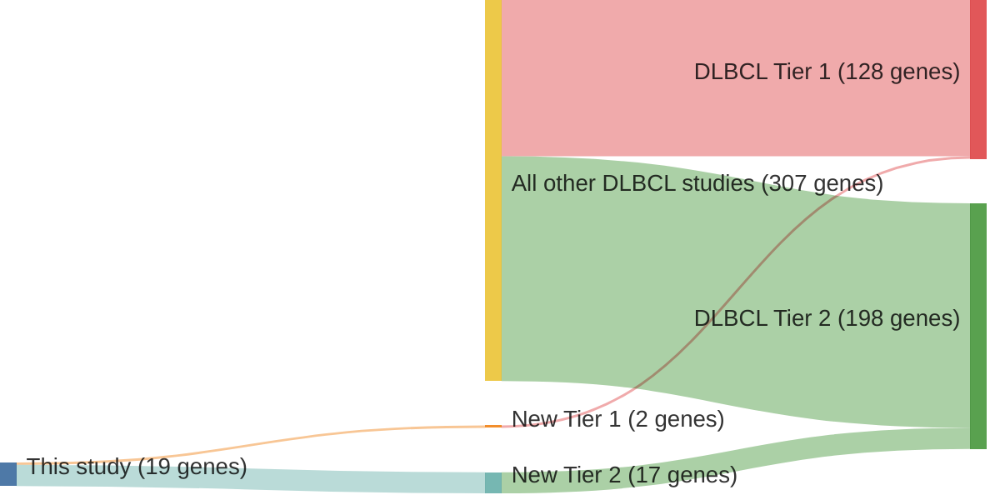

# @chapuyMolecularSubtypesDiffuse2018b
## Summary of novel genes

|Entity| Tier 1 genes| Tier 2 genes|
|:-:|:-:|:-:|
|DLBCL|2|17|

## Novel genes reported in this study

|New gene|DLBCL tier|
|:-|:-:|
|[CCL4](../CCL4)|2 |
|[COQ7](../COQ7)|2 |
|[CRIP1](../CRIP1)|2 |
|[DOCK1](../DOCK1)|2 |
|[FUT5](../FUT5)|2 |
|[GABRA2](../GABRA2)|2 |
|[HIST1H1B](../HIST1H1B)|1 |
|[IL6](../IL6)|2 |
|[LTB](../LTB)|1 |
|[LYN](../LYN)|2 |
|[NANOG](../NANOG)|2 |
|[NAV1](../NAV1)|2 |
|[NLRP8](../NLRP8)|2 |
|[PDE4DIP](../PDE4DIP)|2 |
|[PRPS1](../PRPS1)|2 |
|[RAD9A](../RAD9A)|2 |
|[SMEK1](../SMEK1)|2 |
|[TLR2](../TLR2)|2 |
|[ZNF423](../ZNF423)|2 |

# Details

