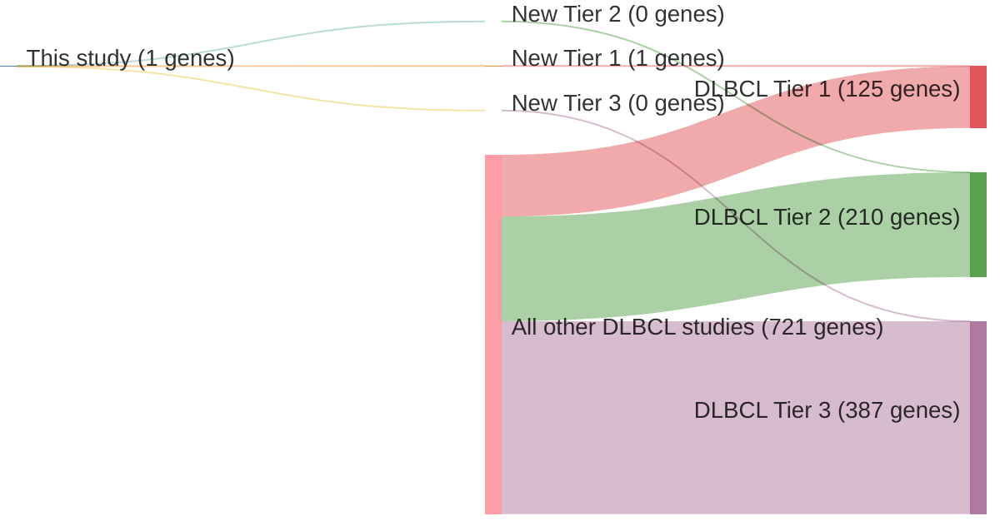

# @compagnoMutationsMultipleGenes2009
## Summary of novel genes

|Entity| Tier 1 genes| Tier 2 genes|Tier 3 genes|
|:-:|:-:|:-:|:-:|
|DLBCL|1|0|0|

## Novel genes reported in this study

### Tier 1
|New gene|DLBCL tier|
|:-|:-:|
|[TNFAIP3](../TNFAIP3)|1 |

# Details

