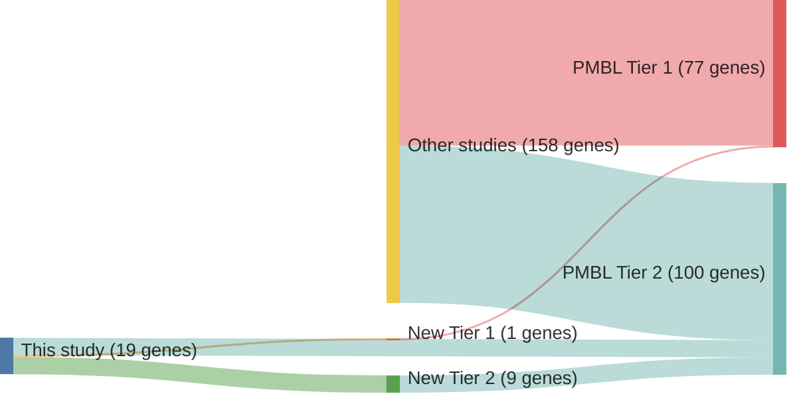

# @deschGenotypingCirculatingTumor2020
## Summary of novel genes

|Entity| Tier 1 genes| Tier 2 genes|
|:-:|:-:|:-:|
|PMBL|1|9|

## Novel genes reported in this study

|New gene|PMBL tier|
|:-|:-:|
|[ACTG1](ACTG1)|2 |
|[CCND3](CCND3)|2 |
|[CDH2](CDH2)|2 |
|[EZR](EZR)|2 |
|[HLA-A](HLA-A)|2 |
|[IGLL5](IGLL5)|2 |
|[KLF2](KLF2)|2 |
|[KMT2D](KMT2D)|2 |
|[LTB](LTB)|1 |
|[MYB](MYB)|2 |

# Details

