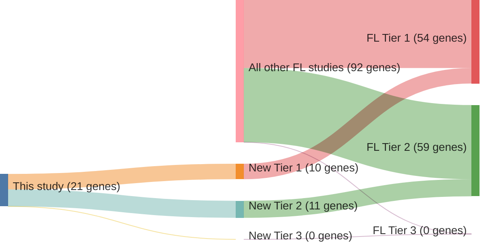

# @drevalGeneticSubdivisionsFollicular2023
## Summary of novel genes

|Entity| Tier 1 genes| Tier 2 genes|Tier 3 genes|
|:-:|:-:|:-:|:-:|
|FL|10|11|0|
|DLBCL|20|1|0|

## Novel genes reported in this study

### Tier 1
|New gene|FL tier|DLBCL tier|
|:-|:-:|:-:|
|[ACTB](../ACTB)|1 |1 |
|[BCL6](../BCL6)|1 |1 |
|[BTG1](../BTG1)|2 |1 |
|[BTG2](../BTG2)|2 |1 |
|[CD79B](../CD79B)|2 |1 |
|[DUSP2](../DUSP2)|2 |1 |
|[EBF1](../EBF1)|1 |1 |
|[GNAI2](../GNAI2)|1 |1 |
|[IRF4](../IRF4)|1 |1 |
|[ITPKB](../ITPKB)|2 |1 |
|[KLF2](../KLF2)|2 |1 |
|[LTB](../LTB)|2 |1 |
|[MYD88](../MYD88)|2 |1 |
|[P2RY8](../P2RY8)|2 |1 |
|[PIM1](../PIM1)|1 |1 |
|[S1PR2](../S1PR2)|2 |1 |
|[SOCS1](../SOCS1)|1 |1 |
|[TBL1XR1](../TBL1XR1)|1 |1 |
|[TMSB4X](../TMSB4X)|1 |1 |
|[TNFAIP3](../TNFAIP3)|1 |1 |

### Tier 2
|New gene|FL tier|DLBCL tier|
|:-|:-:|:-:|
|[PTPRD](../PTPRD)|2 |2 |

# Details

