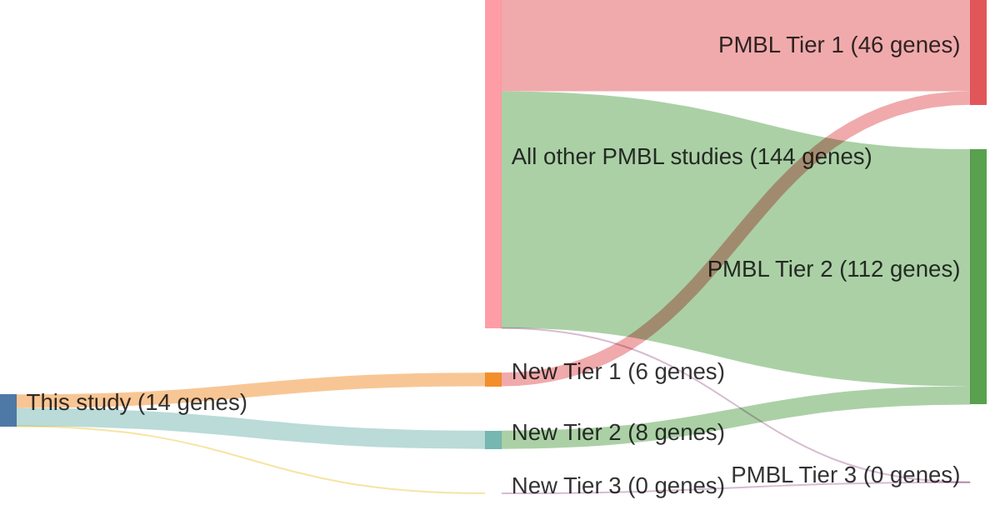

# @dunsCharacterizationDLBCLPMBL2021
## Summary of novel genes

|Entity| Tier 1 genes| Tier 2 genes|Tier 3 genes|
|:-:|:-:|:-:|:-:|
|DLBCL|8|3|0|
|PMBL|6|8|0|

## Novel genes reported in this study

### Tier 1
|New gene|DLBCL tier|PMBL tier| Average variant quality | QC outcome |
|:-|:-:|:-:|:-:|:-:|
|[CD83](../CD83)|1 |1 || |
|[CREBBP](../CREBBP)|1 |1 || |
|[DUSP2](../DUSP2)|1 |1 || |
|[FOXO1](../FOXO1)|1 |2 || |
|[IL4R](../IL4R)|1 |1 || |
|[MYC](../MYC)|1 |2 || |
|[PIM1](../PIM1)|1 |1 || |
|[SGK1](../SGK1)|1 |1 || |

### Tier 2
|New gene|DLBCL tier|PMBL tier| Average variant quality | QC outcome |
|:-|:-:|:-:|:-:|:-:|
|[BIRC3](../BIRC3)|2 |2 || |
|[HRNR](../HRNR)| |2 || |
|[LPHN3](../LPHN3)| |2 || |
|[MCL1](../MCL1)|2 |2 |&starf; &starf; &starf; &star; &star; |PASS |
|[RFTN1](../RFTN1)|2 |2 || |
|[WDR87](../WDR87)| |2 || |

# Details

