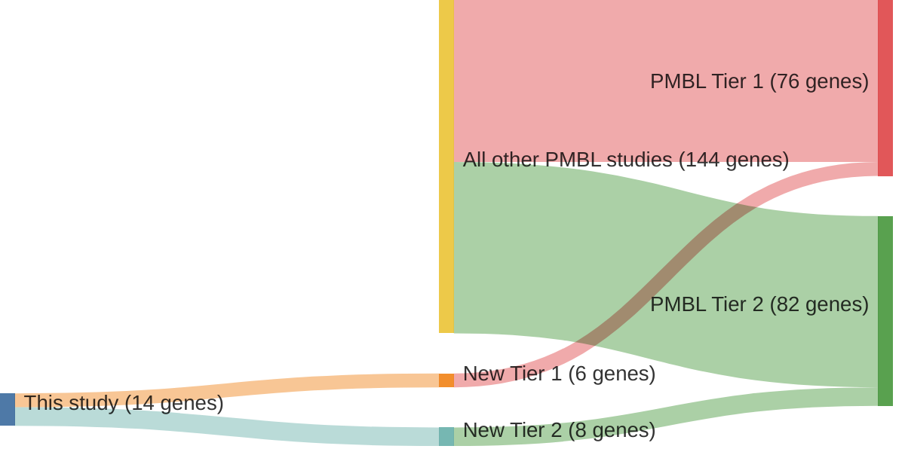

# @dunsCharacterizationDLBCLPMBL2021b
## Summary of novel genes

|Entity| Tier 1 genes| Tier 2 genes|
|:-:|:-:|:-:|
|PMBL|6|8|
|DLBCL|8|3|

## Novel genes reported in this study

### Tier 1
|New gene|PMBL tier|DLBCL tier|
|:-|:-:|:-:|
|[CD83](../CD83)|1 |1 |
|[CREBBP](../CREBBP)|1 |1 |
|[DUSP2](../DUSP2)|1 |1 |
|[FOXO1](../FOXO1)|2 |1 |
|[IL4R](../IL4R)|1 |1 |
|[MYC](../MYC)|2 |1 |
|[PIM1](../PIM1)|1 |1 |
|[SGK1](../SGK1)|1 |1 |

### Tier 2
|New gene|PMBL tier|DLBCL tier|
|:-|:-:|:-:|
|[BIRC3](../BIRC3)|2 |2 |
|[HRNR](../HRNR)|2 | |
|[LPHN3](../LPHN3)|2 | |
|[MCL1](../MCL1)|2 |2 |
|[RFTN1](../RFTN1)|2 |2 |
|[WDR87](../WDR87)|2 | |

# Details

