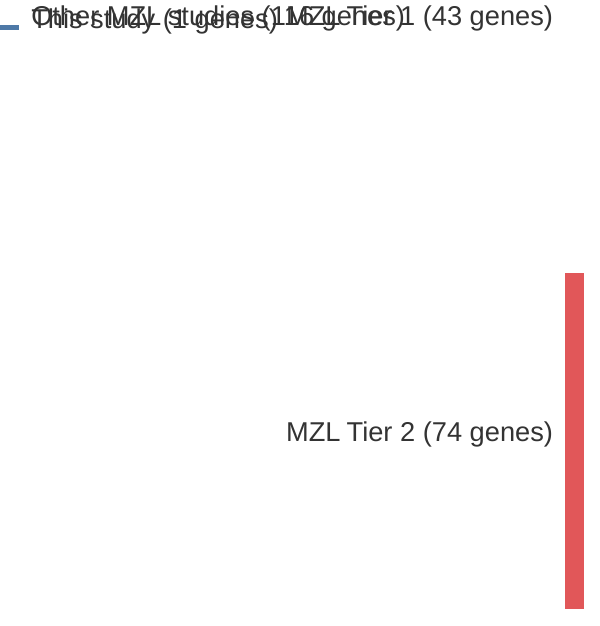

# @ganapathiGeneticLandscapeDural2016
## Summary of novel genes

|Entity| Tier 1 genes| Tier 2 genes|
|:-:|:-:|:-:|
|MZL|1||

## Novel genes reported in this study

|New gene|MZL tier|
|:-|:-:|
|[KLHL6](KLHL6)|1 |

# Details

