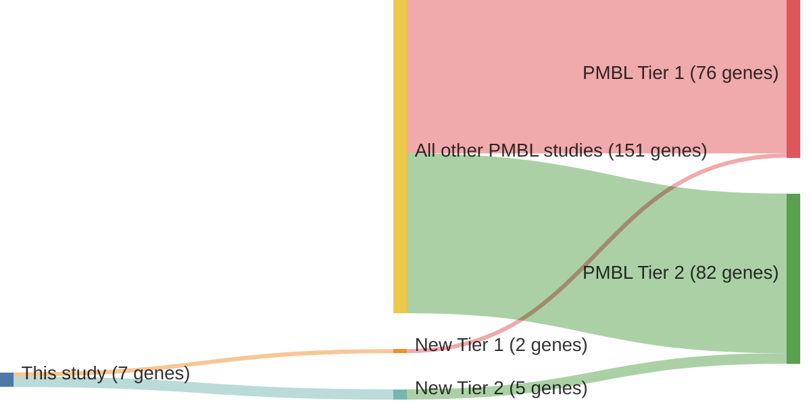

# @gomezUltraDeepSequencingReveals2023
## Summary of novel genes

|Entity| Tier 1 genes| Tier 2 genes|
|:-:|:-:|:-:|
|PMBL|2|5|

## Novel genes reported in this study

### Tier 1
|New gene|PMBL tier|
|:-|:-:|
|[ARID5B](../ARID5B)|1 |
|[DTX1](../DTX1)|1 |

### Tier 2
|New gene|PMBL tier|
|:-|:-:|
|[AXDND1](../AXDND1)|2 |
|[CDH5](../CDH5)|2 |
|[HLA-C](../HLA-C)|2 |
|[LIMD2](../LIMD2)|2 |
|[OR13C2](../OR13C2)|2 |

# Details

