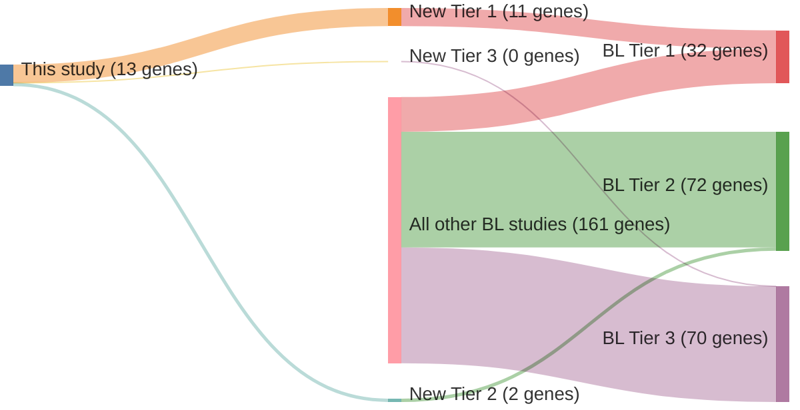

# @grandeGenomewideDiscoverySomatic2019
## Summary of novel genes

|Entity| Tier 1 genes| Tier 2 genes|Tier 3 genes|
|:-:|:-:|:-:|:-:|
|BL|11|2|0|

## Novel genes reported in this study

### Tier 1
|New gene|BL tier|
|:-|:-:|
|[BACH2](../BACH2)|1 |
|[BCL7A](../BCL7A)|1 |
|[CHD8](../CHD8)|1 |
|[GNAI2](../GNAI2)|1 |
|[HIST1H1E](../HIST1H1E)|1 |
|[KMT2D](../KMT2D)|1 |
|[RFX7](../RFX7)|1 |
|[SIN3A](../SIN3A)|1 |
|[TCL1A](../TCL1A)|1 |
|[TFAP4](../TFAP4)|1 |
|[USP7](../USP7)|1 |

### Tier 2
|New gene|BL tier|
|:-|:-:|
|[CDKN2A](../CDKN2A)|2 |
|[MIR142](../MIR142)|2 |

# Details

