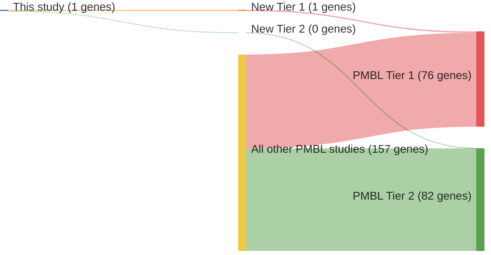

# @gunawardanaRecurrentSomaticMutations2014c
## Summary of novel genes

|Entity| Tier 1 genes| Tier 2 genes|
|:-:|:-:|:-:|
|PMBL|1|0|

## Novel genes reported in this study

### Tier 1
|New gene|PMBL tier|
|:-|:-:|
|[PTPN1](../PTPN1)|1 |

# Details

