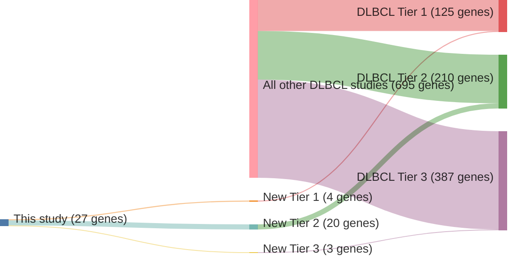

# @hubschmannMutationalMechanismsShaping2021

## Study Overview
In their 2021 study published in *Leukemia*, Hübschmann et al. conducted a comprehensive analysis of 181 germinal center-derived B-cell lymphomas (gcBCLs) using whole-genome and transcriptome sequencing. The research aimed to elucidate the mutational mechanisms influencing both coding and noncoding regions of the genome in these lymphomas.

## Key Findings

### Mutational Signatures
- The study identified distinct mutational signatures associated with somatic hypermutation (SHM) and class-switch recombination (CSR).
- Both SHM and CSR were found to contribute to off-target mutations in non-immunoglobulin (non-IG) genes, suggesting a broader impact on genomic integrity.

### Noncoding Regions
- Mutations were prevalent in noncoding regions, including promoters and enhancers, indicating potential regulatory disruptions.
- These noncoding mutations may influence gene expression and contribute to lymphomagenesis.

### Pathway Alterations
- Recurrent mutations were observed in pathways related to B-cell development and function, such as the NF-κB and JAK-STAT signaling pathways.
- These alterations underscore the role of specific signaling cascades in the pathogenesis of gcBCLs.

## Clinical Implications
- The findings highlight the significance of both coding and noncoding mutations in the development of gcBCLs.
- Understanding these mutational mechanisms may inform targeted therapeutic strategies and improve diagnostic precision.

---

## Conclusion
Hübschmann et al.'s study provides valuable insights into the mutational processes shaping the genomes of germinal center-derived B-cell lymphomas. By revealing the contributions of SHM and CSR to off-target mutations and emphasizing the importance of noncoding regions, this research advances our understanding of lymphoma biology and potential avenues for treatment.

## Summary of novel genes

|Entity| Tier 1 genes| Tier 2 genes|Tier 3 genes|
|:-:|:-:|:-:|:-:|
|FL|2|16|0|
|DLBCL|4|20|3|

## Novel genes reported in this study

### Tier 1
|New gene|FL tier|DLBCL tier| Average variant quality | QC outcome |
|:-|:-:|:-:|:-:|:-:|
|[ACTG1](../ACTG1)|2 |1 || |
|[EEF1A1](../EEF1A1)|1 |1 || |
|[HLA-DMB](../HLA-DMB)| |1 || |
|[MEF2C](../MEF2C)|2 |1 || |
|[VMA21](../VMA21)|1 | || |

### Tier 2
|New gene|FL tier|DLBCL tier| Average variant quality | QC outcome |
|:-|:-:|:-:|:-:|:-:|
|[ADAMTS1](../ADAMTS1)| |2 |&starf; &starf; &starf; &star; &star; |PASS |
|[ANKRD12](../ANKRD12)| |2 |&starf; &starf; &starf; &star; &star; |PASS |
|[ATP6V1A](../ATP6V1A)|2 | || |
|[CADPS2](../CADPS2)| |2 |&starf; &starf; &starf; &starf; &star; |PASS |
|[CDC42BPB](../CDC42BPB)|2 | || |
|[CNOT2](../CNOT2)| |2 |&starf; &starf; &starf; &starf; &star; |PASS |
|[CPNE8](../CPNE8)|2 | || |
|[DHX15](../DHX15)|2 | || |
|[DHX16](../DHX16)| |2 |&starf; &starf; &starf; &starf; &star; |PASS |
|[DNM2](../DNM2)| |2 |&starf; &starf; &starf; &star; &star; |PASS |
|[FZR1](../FZR1)|2 | || |
|[IKBKE](../IKBKE)| |2 |&starf; &starf; &starf; &starf; &star; |PASS |
|[IRF1](../IRF1)| |2 |&starf; &starf; &starf; &star; &star; |PASS |
|[JUP](../JUP)|2 | || |
|[LAPTM5](../LAPTM5)|2 |2 |&starf; &starf; &starf; &starf; &star; |PASS |
|[LRP12](../LRP12)| |2 |&starf; &starf; &starf; &star; &star; |PASS |
|[MGEA5](../MGEA5)|2 | || |
|[MYCBP2](../MYCBP2)|2 | || |
|[PDS5B](../PDS5B)|2 |2 |&starf; &starf; &starf; &starf; &star; |PASS |
|[PNPO](../PNPO)| |2 |&starf; &starf; &starf; &star; &star; |PASS |
|[PPP4C](../PPP4C)|2 | || |
|[PRKDC](../PRKDC)|2 |2 || |
|[RAC2](../RAC2)| |2 |&starf; &starf; &starf; &star; &star; |PASS |
|[RBM6](../RBM6)|2 | || |
|[SIAH2](../SIAH2)| |2 |&starf; &starf; &starf; &star; &star; |PASS |
|[SLC34A2](../SLC34A2)| |2 |&starf; &starf; &starf; &star; &star; |PASS |
|[TPP1](../TPP1)|2 | || |
|[TRAF6](../TRAF6)| |2 |&starf; &starf; &starf; &star; &star; |PASS |
|[UNC5B](../UNC5B)| |2 |&starf; &starf; &starf; &star; &star; |PASS |
|[WNK1](../WNK1)| |2 |&starf; &starf; &starf; &star; &star; |PASS |
|[ZNF217](../ZNF217)| |2 |&starf; &starf; &starf; &star; &star; |PASS |

### Tier 3
|New gene|FL tier|DLBCL tier| Average variant quality | QC outcome |
|:-|:-:|:-:|:-:|:-:|
|[GAK](../GAK)| |3 |&starf; &starf; &star; &star; &star; |FAIL |
|[HLA-DQA1](../HLA-DQA1)| |3 |&starf; &starf; &star; &star; &star; |FAIL |
|[NR2F2](../NR2F2)| |3 |&starf; &starf; &star; &star; &star; |FAIL |

# Details

