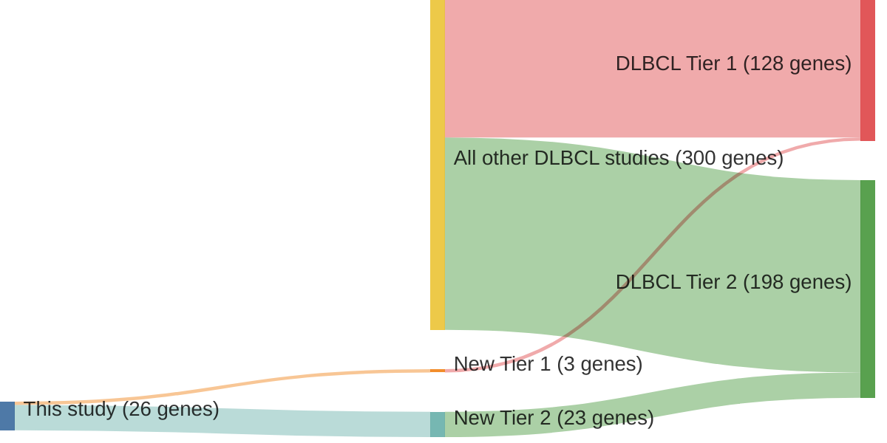

# @hubschmannMutationalMechanismsShaping2021b
## Summary of novel genes

|Entity| Tier 1 genes| Tier 2 genes|
|:-:|:-:|:-:|
|FL|2|15|
|DLBCL|3|23|

## Novel genes reported in this study

### Tier 1
|New gene|FL tier|DLBCL tier|
|:-|:-:|:-:|
|[ACTG1](../ACTG1)|2 |1 |
|[EEF1A1](../EEF1A1)|1 |1 |
|[FBXO11](../FBXO11)| |1 |
|[VMA21](../VMA21)|1 | |

### Tier 2
|New gene|FL tier|DLBCL tier|Average variant quality|QC outcome|
|:-|:-:|:-:|:-:|:-:|
|[ADAMTS1](../ADAMTS1)| |2 |&starf; &starf; &starf; &star; &star; | **Pass** |
|[ANKRD12](../ANKRD12)| |2 |&starf; &starf; &starf; &star; &star; | **Pass** |
|[ATP6V1A](../ATP6V1A)|2 | |&starf; &starf; &starf; &starf; &star; | **Pass** |
|[CADPS2](../CADPS2)| |2 |&starf; &starf; &starf; &starf; &star; | **Pass** |
|[CDC42BPB](../CDC42BPB)|2 | |&starf; &starf; &starf; &star; &star;|**Pass**|
|[CNOT2](../CNOT2)| |2 |&starf; &starf; &starf; &starf; &star;|**Pass**|
|[CPNE8](../CPNE8)|2 | |&starf; &starf; &starf; &starf; &star;|**Pass**|
|[DHX15](../DHX15)|2 | |&starf; &starf; &starf; &starf; &star;|**Pass**|
|[DHX16](../DHX16)| |2 |&starf; &starf; &starf; &starf; &star;|**Pass**|
|[DNM2](../DNM2)| |2 |&starf; &starf; &starf; &star; &star;|**Pass**|
|[FZR1](../FZR1)|2 | |&starf; &starf; &starf; &star; &star;|**Pass**|
|[HLA-DQA1](../HLA-DQA1)| |2 |||
|[IKBKE](../IKBKE)| |2 |&starf; &starf; &starf; &starf; &star;|**Pass**|
|[IRF1](../IRF1)| |2 |&starf; &starf; &starf; &star; &star;|**Pass**|
|[JUP](../JUP)|2 | |&starf; &starf; &starf; &starf; &star;|**Pass**|
|[LAPTM5](../LAPTM5)|2 |2 |&starf; &starf; &starf; &starf; &star;|**Pass**|
|[LRP12](../LRP12)| |2 |&starf; &starf; &starf; &star; &star;|**Pass**|
|[MGEA5](../MGEA5)|2 | |&starf; &starf; &starf; &star; &star;|**Pass**|
|[MYCBP2](../MYCBP2)|2 | |&starf; &starf; &starf; &starf; &star;|**Pass**|
|[NR2F2](../N2RF2)| |2 |||
|[PDS5B](../PDS5B)|2 |2 |||
|[PNPO](../PNPO)| |2 |||
|[PPP4C](../PPP4C)|2 | |||
|[PRKDC](../PRKDC)|2 |2 |||
|[RAC2](../RAC2)| |2 |||
|[RBM6](../RBM6)|2 | |||
|[SIAH2](../SIAH2)| |2 |||
|[SLC34A2](../SLC34A2)| |2 |||
|[TPP1](../TPP1)|2 | |||
|[TRAF6](../TRAF6)| |2 |||
|[UNC5B](../UNC5B)| |2 |||
|[WNK1](../WNK1)| |2 |||
|[ZNF217](../ZNF217)| |2 |||
|[GAK](../GAK)| |2 |&starf; &starf; &star; &star; &star;|**Fail**|

# Details

