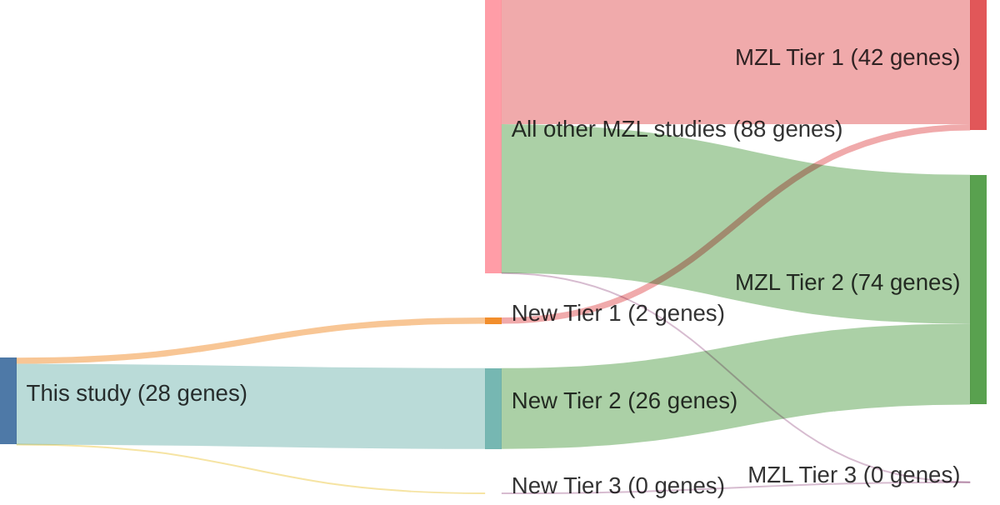

# @jalladesExomeSequencingIdentifies2017
## Summary of novel genes

|Entity| Tier 1 genes| Tier 2 genes|Tier 3 genes|
|:-:|:-:|:-:|:-:|
|MZL|2|26|0|

## Novel genes reported in this study

### Tier 1
|New gene|MZL tier|
|:-|:-:|
|[CCND3](../CCND3)|1 |
|[KLF2](../KLF2)|1 |

### Tier 2
|New gene|MZL tier|
|:-|:-:|
|[ARHGAP20](../ARHGAP20)|2 |
|[ARHGEF15](../ARHGEF15)|2 |
|[ARHGEF17](../ARHGEF17)|2 |
|[BCOR](../BCOR)|2 |
|[DNAH5](../DNAH5)|2 |
|[DNAH7](../DNAH7)|2 |
|[DNAI1](../DNAI1)|2 |
|[DOCK6](../DOCK6)|2 |
|[DTX3L](../DTX3L)|2 |
|[EZH1](../EZH1)|2 |
|[HIST1H1D](../HIST1H1D)|2 |
|[HIST1H2AD](../HIST1H2AD)|2 |
|[HIST4H4](../HIST4H4)|2 |
|[HRAS](../HRAS)|2 |
|[KAT6A](../KAT6A)|2 |
|[KDM6A](../KDM6A)|2 |
|[KIF26A](../KIF26A)|2 |
|[MGA](../MGA)|2 |
|[MYC](../MYC)|2 |
|[MYLK](../MYLK)|2 |
|[NCOA6](../NCOA6)|2 |
|[NRAS](../NRAS)|2 |
|[RAF1](../RAF1)|2 |
|[ROCK1](../ROCK1)|2 |
|[TBK1](../TBK1)|2 |
|[WNK1](../WNK1)|2 |

# Details

