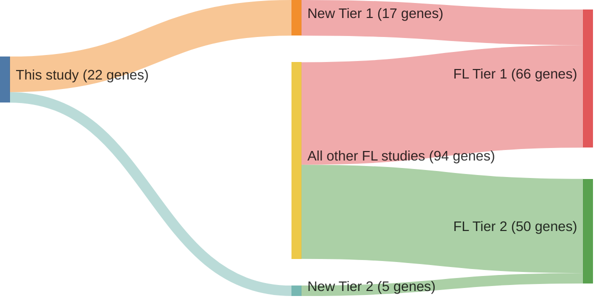

# @krysiakRecurrentSomaticMutations2017b
## Summary of novel genes

|Entity| Tier 1 genes| Tier 2 genes|
|:-:|:-:|:-:|
|FL|17|5|

## Novel genes reported in this study

### Tier 1
|New gene|FL tier|
|:-|:-:|
|[ARID1A](../ARID1A)|1 |
|[BCL7A](../BCL7A)|1 |
|[BTK](../BTK)|1 |
|[HIST1H1B](../HIST1H1B)|1 |
|[HIST1H1D](../HIST1H1D)|1 |
|[HIST1H1E](../HIST1H1E)|1 |
|[HIST1H2AC](../HIST1H2AC)|1 |
|[HIST1H2AG](../HIST1H2AG)|1 |
|[HIST1H2AM](../HIST1H2AM)|1 |
|[HIST1H2BC](../HIST1H2BC)|1 |
|[HIST1H2BD](../HIST1H2BD)|1 |
|[HIST1H2BG](../HIST1H2BG)|1 |
|[HIST1H3G](../HIST1H3G)|1 |
|[HVCN1](../HVCN1)|1 |
|[POU2AF1](../POU2AF1)|1 |
|[POU2F2](../POU2F2)|1 |
|[SMARCA4](../SMARCA4)|1 |

### Tier 2
|New gene|FL tier|
|:-|:-:|
|[CXCR4](../CXCR4)|2 |
|[EGR1](../EGR1)|2 |
|[HIST1H2BM](../HIST1H2BM)|2 |
|[HIST1H3I](../HIST1H3I)|2 |
|[ZNF608](../ZNF608)|2 |

# Details

