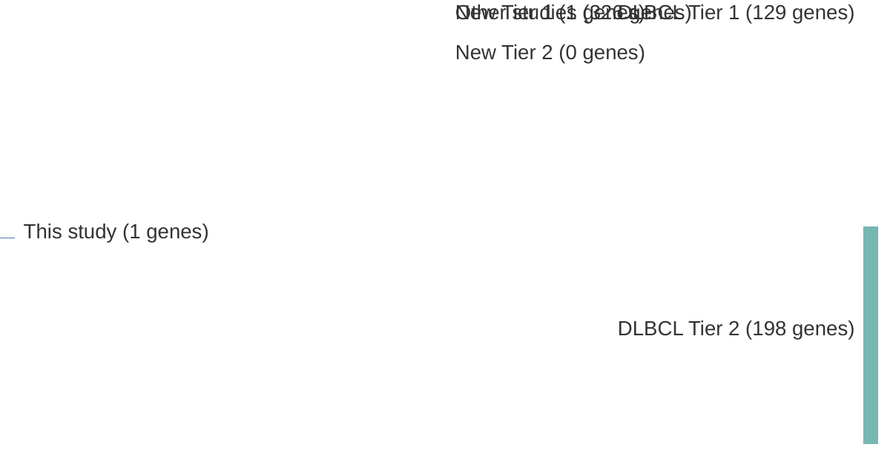

# @lenzOncogenicCARD11Mutations2008
## Summary of novel genes

|Entity| Tier 1 genes| Tier 2 genes|
|:-:|:-:|:-:|
|DLBCL|1||

## Novel genes reported in this study

|New gene|DLBCL tier|
|:-|:-:|
|[CARD11](CARD11)|1 |

# Details

