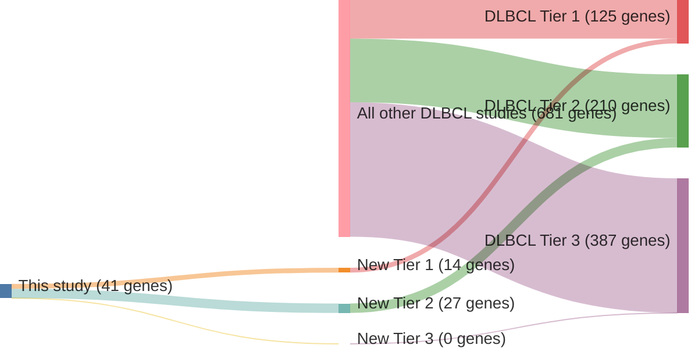

# @lohrDiscoveryPrioritizationSomatic2012
## Summary of novel genes

|Entity| Tier 1 genes| Tier 2 genes|Tier 3 genes|
|:-:|:-:|:-:|:-:|
|DLBCL|14|27|0|

## Novel genes reported in this study

### Tier 1
|New gene|DLBCL tier| Average variant quality | QC outcome |
|:-|:-:|:-:|:-:|
|[ACTB](../ACTB)|1 || |
|[DUSP2](../DUSP2)|1 || |
|[ETV6](../ETV6)|1 || |
|[HIST1H1E](../HIST1H1E)|1 || |
|[HIST1H2BC](../HIST1H2BC)|1 || |
|[HIST1H3B](../HIST1H3B)|1 || |
|[HLA-A](../HLA-A)|1 || |
|[HLA-B](../HLA-B)|1 || |
|[JUNB](../JUNB)|1 |&starf; &starf; &starf; &star; &star; |PASS |
|[KRAS](../KRAS)|1 || |
|[P2RY8](../P2RY8)|1 || |
|[POU2F2](../POU2F2)|1 || |
|[TBL1XR1](../TBL1XR1)|1 || |
|[UBE2A](../UBE2A)|1 || |

### Tier 2
|New gene|DLBCL tier| Average variant quality | QC outcome |
|:-|:-:|:-:|:-:|
|[BCR](../BCR)|2 || |
|[CPS1](../CPS1)|2 || |
|[GABRA1](../GABRA1)|2 || |
|[H1FOO](../H1FOO)|2 || |
|[HIST1H2AL](../HIST1H2AL)|2 || |
|[HIST1H2BO](../HIST1H2BO)|2 || |
|[HIST1H3A](../HIST1H3A)|2 || |
|[KRTAP5-5](../KRTAP5-5)|2 || |
|[OR6K3](../OR6K3)|2 || |
|[PASD1](../PASD1)|2 || |
|[PCDHB6](../PCDHB6)|2 || |
|[PCLO](../PCLO)|2 || |
|[PDGFC](../PDGFC)|2 || |
|[PTPN21](../PTPN21)|2 || |
|[RBP3](../RBP3)|2 || |
|[S1PR1](../S1PR1)|2 || |
|[SLC38A8](../SLC38A8)|2 || |
|[SLITRK6](../SLITRK6)|2 || |
|[SRPX](../SRPX)|2 || |
|[SYN2](../SYN2)|2 || |
|[TBP](../TBP)|2 || |
|[TMSL3](../TMSL3)|2 || |
|[TNF](../TNF)|2 || |
|[UNC5C](../UNC5C)|2 || |
|[UNC5D](../UNC5D)|2 || |
|[VAX1](../VAX1)|2 || |
|[ZNF385B](../ZNF385B)|2 || |

# Details

