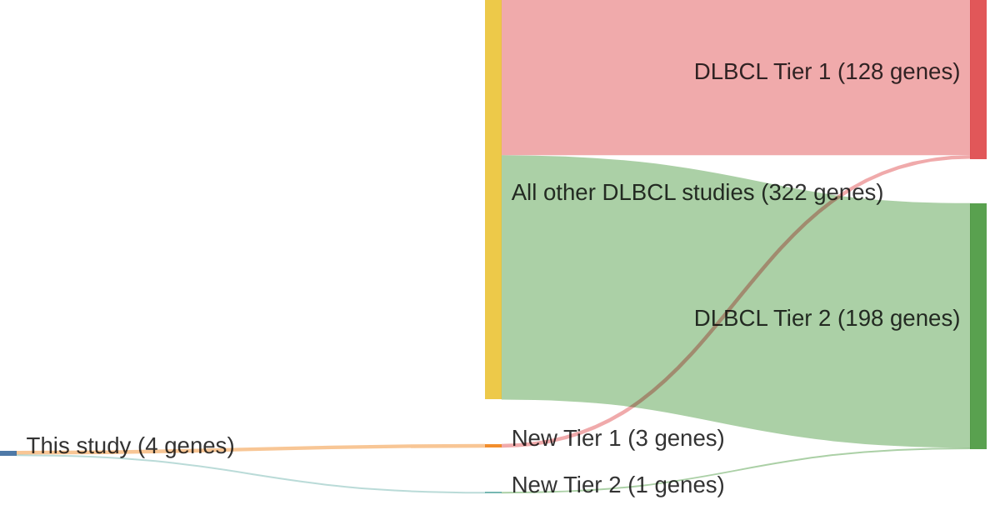

# @lohrDiscoveryPrioritizationSomatic2012a
## Summary of novel genes

|Entity| Tier 1 genes| Tier 2 genes|
|:-:|:-:|:-:|
|DLBCL|3|1|

## Novel genes reported in this study

|New gene|DLBCL tier|
|:-|:-:|
|[ACTB](ACTB)|1 |
|[KRAS](KRAS)|1 |
|[P2RY8](P2RY8)|1 |
|[PCLO](PCLO)|2 |

# Details

