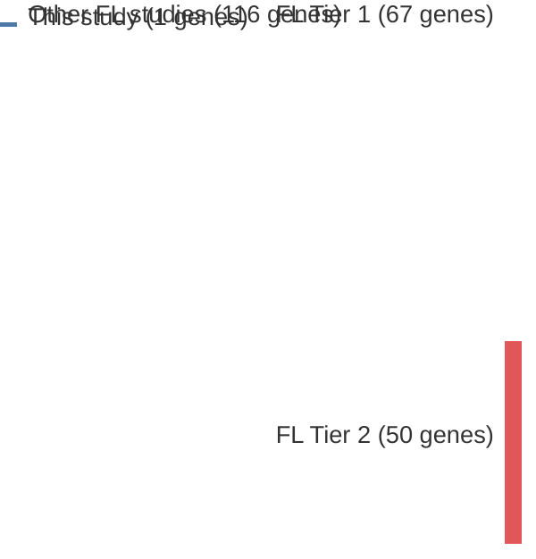

# @louissaintPediatrictypeNodalFollicular2016a
## Summary of novel genes

|Entity| Tier 1 genes| Tier 2 genes|
|:-:|:-:|:-:|
|FL|1||

## Novel genes reported in this study

|New gene|FL tier|
|:-|:-:|
|[MAP2K1](MAP2K1)|1 |

# Details

