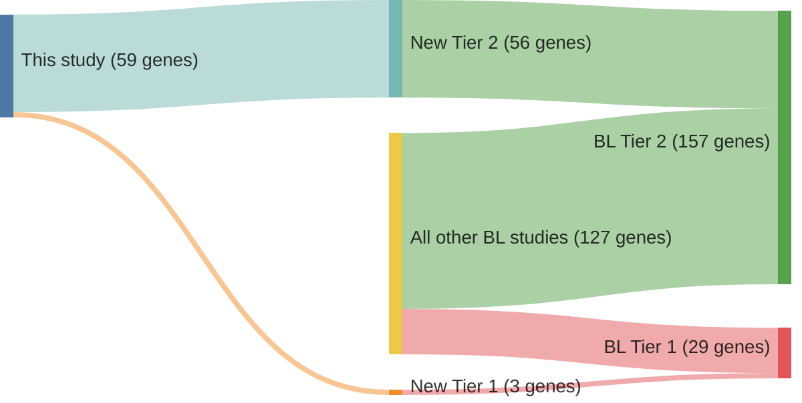

# @loveGeneticLandscapeMutations2012
## Summary of novel genes

|Entity| Tier 1 genes| Tier 2 genes|
|:-:|:-:|:-:|
|BL|3|56|

## Novel genes reported in this study

### Tier 1
|New gene|BL tier|
|:-|:-:|
|[ARID1A](../ARID1A)|1 |
|[GNA13](../GNA13)|1 |
|[PTEN](../PTEN)|1 |

### Tier 2
|New gene|BL tier|Rating of reviewed variants|
|:-|:-:|:-:|
|[ACAD9](../ACAD9)|2 |&starf; &star; &star; &star; &star;|
|[ACE](../ACE)|2 |&starf; &star; &star; &star; &star;|
|[ATP2C2](../ATP2C2)|2 |&starf; &starf; &star; &star; &star;|
|[BCL6](../BCL6)|2 |&starf; &starf; &starf; &starf; &star;|
|[BRAF](../BRAF)|2 |&starf; &star; &star; &star; &star;|
|[BRD4](../BRD4)|2 |&starf; &star; &star; &star; &star;|
|[BTG2](../BTG2)|2 |&starf; &star; &star; &star; &star;|
|[C6orf27](../C6orf27)|2 |&starf; &star; &star; &star; &star;|
|[CAD](../CAD)|2 |&starf; &star; &star; &star; &star;|
|[CARD4](../CARD4)|2 |&starf; &starf; &starf; &starf; &star;|
|[CCT6B](../CCT6B)|2 |*Germline*|
|[CDC73](../CDC73)|2 |&starf; &starf; &starf; &star; &star;|
|[CDH17](../CDH17)|2 |&starf; &star; &star; &star; &star;|
|[COL4A2](../COL4A2)|2 |&starf; &star; &star; &star; &star;|
|[CREBBP](../CREBBP)|2 |&starf; &starf; &starf; &starf; &star;|
|[CYB5D1](../CYB5D1)|2 |&starf; &starf; &star; &star; &star;|
|[CYP4F22](../CYP4F22)|2 |&starf; &star; &star; &star; &star;|
|[DLGAP1](../DLGAP1)|2 |&starf; &star; &star; &star; &star;|
|[DTX1](../DTX1)|2|&starf; &star; &star; &star; &star;|
|[EIF2C4](../EIF2C4)|2 |&starf; &star; &star; &star; &star;|
|[EML2](../EML2)|2 |&starf; &star; &star; &star; &star;|
|[ENTPD3](../ENTPD3)|2 |&starf; &starf; &star; &star; &star;|
|[EPHB2](../EPHB2)|2 |&starf; &starf; &star; &star; &star;|
|[EZH2](../EZH2)|2 |&starf; &starf; &starf; &starf; &starf;|
|[FAM129B](../FAM129B)|2 |&starf; &starf; &star; &star; &star;|
|[FGFR3](../FGFR3)|2 |&starf; &star; &star; &star; &star;|
|[FTCD](../FTCD)|2 ||
|[GGTLA4](../GGTLA4)|2 ||
|[GRIK5](../GRIK5)|2 ||
|[ICK](../ICK)|2 ||
|[ITPR3](../ITPR3)|2 ||
|[KIFC3](../KIFC3)|2 |&starf; &star; &star; &star; &star;|
|[MAP3K6](../MAP3K6)|2 ||
|[MYH10](../MYH10)|2 ||
|[NBEAL1](../NBEAL1)|2 ||
|[NOTCH1](../NOTCH1)|2 |&starf; &star; &star; &star; &star;|
|[NRXN2](../NRXN2)|2 ||
|[P2RY2](../P2RY2)|2 ||
|[PC](../PC)|2 |&starf; &star; &star; &star; &star;|
|[POLRMT](../POLRMT)|2 ||
|[POR](../POR)|2 ||
|[PRSS22](../PRSS22)|2 |&starf; &star; &star; &star; &star;|
|[PTPRN](../PTPRN)|2 ||
|[RANBP6](../RANBP6)|2 ||
|[RBP3](../RBP3)|2 ||
|[RET](../RET)|2 |&starf; &star; &star; &star; &star;|
|[SALL3](../SALL3)|2 ||
|[SAPS2](../SAPS2)|2 ||
|[SBF1](../SBF1)|2 ||
|[SF3B1](../SF3B1)|2 ||
|[SHANK1](../SHANK1)|2 ||
|[SLC29A2](../SLC29A2)|2 ||
|[SYNGAP1](../SYNGAP1)|2 |&starf; &star; &star; &star; &star;|
|[TBC1D9B](../TBC1D9B)|2 ||
|[TIGD6](../TIGD6)|2 ||
|[TPST2](../TPST2)|2 ||
|[ZNF229](../ZNF229)|2 |*Germline*|

# Details

