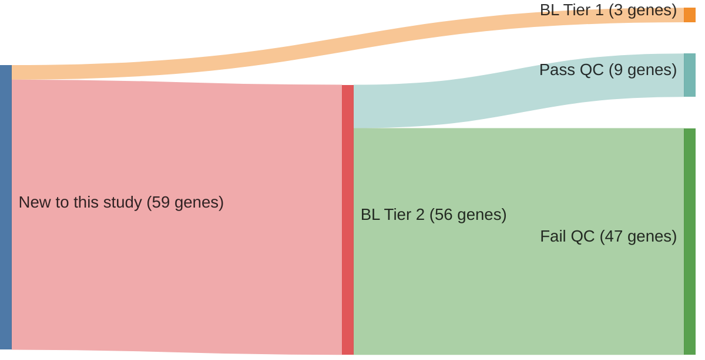

# @loveGeneticLandscapeMutations2012

# Summary

The 2012 study provided foundational insights into the genetic landscape of Burkitt lymphoma (BL),
identifying recurrent mutations in genes such as **MYC**, **ID3**, **ARID1A**, **SMARCA4**, and **TP53**.
Subsequent research has both validated and expanded upon these findings.

## Reproduced Findings
- **ID3 Mutations**: The initial identification of **ID3** mutations in approximately one-third of BL cases 
has been consistently corroborated. These mutations, particularly affecting the helix-loop-helix domain, 
are recognized as a hallmark of BL and are rare in other lymphomas.
- **ARID1A and SMARCA4 Mutations**: Mutations in **ARID1A** and **SMARCA4**, components of the SWI/SNF
chromatin-remodeling complex, have been confirmed in BL. These mutations are often mutually exclusive,
suggesting that alteration in one is sufficient to disrupt the complex's function.
- **TP53 Mutations**: Alterations in **TP53** have been consistently observed in BL, underscoring its role
in the disease's pathogenesis.

## Expanded Insights
- **GNA13 Mutations**: The initial study noted mutations in **GNA13**. Further research has highlighted its
role in BL, particularly in germinal center B cell–derived lymphomas.
- **Additional Mutations**: Subsequent studies have identified mutations in genes such as **TCF3**, 
**CCND3**, and **DDX3X**, which were not prominently featured in the 2012 study. These findings have 
enriched the understanding of BL's genetic complexity.

## Less Reproduced Findings
- **CCT6B, SALL3, FTCD, and PC Mutations**: The study reported mutations in **CCT6B**, **SALL3**, **FTCD**, 
and **PC**. However, these findings have not been consistently replicated in subsequent research, suggesting
they may be less central to BL's pathogenesis or represent less common alterations.

## In Summary
This study identified some genes that are commonly mutated in BL. Some of its novel findings have been 
validated and expanded upon, while some gene mutations are of questionable
significance in BL.

## Summary of novel genes

|Entity| Total| Tier 1| Tier 2| Tier 2 Pass| Tier 2 Fail| Fail rate |
|:-:|:-:|:-:|:-:|:-:|:-:|:-:|
|BL|60|3|57|9|48| 84% |

## Novel genes reported in this study

### Tier 1
|New gene|BL tier|
|:-|:-:|
|[ARID1A](../ARID1A)|1 |
|[GNA13](../GNA13)|1 |
|[PTEN](../PTEN)|1 |

### Tier 2
|Novel gene|DLBCL tier|Average variant quality|QC outcome|
|:-|:-:|:-:|:-:|
|[BCL6](../BCL6)|2 |&starf; &starf; &starf; &starf; &star;|**Pass**|
|[CARD4](../CARD4)|2 |&starf; &starf; &starf; &starf; &star;|**Pass**|
|[CDC73](../CDC73)|2 |&starf; &starf; &starf; &star; &star;|**Pass**|
|[CREBBP](../CREBBP)|2 |&starf; &starf; &starf; &starf; &star;|**Pass**|
|[EZH2](../EZH2)|2 |&starf; &starf; &starf; &starf; &starf;|**Pass**|
|[GGTLA4](../GGTLA4)|2 |&starf; &starf; &starf; &starf; &star;|**Pass**|
|[P2RY2](../P2RY2)|2 |&starf; &starf; &starf; &starf; &star;|**Pass**|
|[NBEAL1](../NBEAL1)|2 |&starf; &starf; &starf; &starf; &star;|**Pass**|
|[RANBP6](../RANBP6)|2 |&starf; &starf; &starf; &starf; &starf;|**Pass**|
|[ACAD9](../ACAD9)|2 |&starf; &star; &star; &star; &star;|**Fail**|
|[ACE](../ACE)|2 |&starf; &star; &star; &star; &star;|**Fail**|
|[ATP2C2](../ATP2C2)|2 |&starf; &starf; &star; &star; &star;|**Fail**|
|[BRAF](../BRAF)|2 |&starf; &star; &star; &star; &star;|**Fail**|
|[BRD4](../BRD4)|2 |&starf; &star; &star; &star; &star;|**Fail**|
|[BTG2](../BTG2)|2 |&starf; &star; &star; &star; &star;|**Fail**|
|[C6orf27](../C6orf27)|2 |*Germline*|**Fail**|
|[CAD](../CAD)|2 |&starf; &star; &star; &star; &star;|**Fail**|
|[CCT6B](../CCT6B)|2 |*Germline*|**Fail**|
|[CDH17](../CDH17)|2 |&starf; &star; &star; &star; &star;|**Fail**|
|[COL4A2](../COL4A2)|2 |&starf; &star; &star; &star; &star;|**Fail**|
|[CYB5D1](../CYB5D1)|2 |&starf; &starf; &star; &star; &star;|**Fail**|
|[CYP4F22](../CYP4F22)|2 |&starf; &star; &star; &star; &star;|**Fail**|
|[DLGAP1](../DLGAP1)|2 |&starf; &star; &star; &star; &star;|**Fail**|
|[DTX1](../DTX1)|2|&starf; &star; &star; &star; &star;|**Fail**|
|[EIF2C4](../EIF2C4)|2 |&starf; &star; &star; &star; &star;|**Fail**|
|[EML2](../EML2)|2 |&starf; &star; &star; &star; &star;|**Fail**|
|[ENTPD3](../ENTPD3)|2 |&starf; &starf; &star; &star; &star;|**Fail**|
|[EPHB2](../EPHB2)|2 |&starf; &starf; &star; &star; &star;|**Fail**|
|[FAM129B](../FAM129B)|2 |&starf; &starf; &star; &star; &star;|**Fail**|
|[FGFR3](../FGFR3)|2 |&starf; &star; &star; &star; &star;|**Fail**|
|[FTCD](../FTCD)|2 |*Germline*|**Fail**|
|[GRIK5](../GRIK5)|2 |&starf; &star; &star; &star; &star;|**Fail**|
|[ICK](../ICK)|2 |&starf; &star; &star; &star; &star;|**Fail**|
|[ITPR3](../ITPR3)|2 |&starf; &star; &star; &star; &star;|**Fail**|
|[KIFC3](../KIFC3)|2 |&starf; &star; &star; &star; &star;|**Fail**|
|[MAP3K6](../MAP3K6)|2 |&starf; &star; &star; &star; &star;|**Fail**|
|[MYH10](../MYH10)|2 |&starf; &star; &star; &star; &star;|**Fail**|
|[NOTCH1](../NOTCH1)|2 |&starf; &star; &star; &star; &star;|**Fail**|
|[NRXN2](../NRXN2)|2 |&starf; &star; &star; &star; &star;|**Fail**|
|[PC](../PC)|2 |&starf; &star; &star; &star; &star;|**Fail**|
|[POLRMT](../POLRMT)|2 |&starf; &star; &star; &star; &star;|**Fail**|
|[POR](../POR)|2 |&starf; &star; &star; &star; &star;|**Fail**|
|[PRSS22](../PRSS22)|2 |&starf; &star; &star; &star; &star;|**Fail**|
|[PTPRN](../PTPRN)|2 |&starf; &star; &star; &star; &star;|**Fail**|
|[RBP3](../RBP3)|2 |&starf; &star; &star; &star; &star;|**Fail**|
|[RET](../RET)|2 |&starf; &star; &star; &star; &star;|**Fail**|
|[SALL3](../SALL3)|2 |&starf; &starf; &star; &star; &star;|**Fail**|
|[SAPS2](../SAPS2)|2 |&starf; &star; &star; &star; &star;|**Fail**|
|[SBF1](../SBF1)|2 |&starf; &starf; &star; &star; &star;|**Fail**|
|[SF3B1](../SF3B1)|2 |&starf; &starf; &starf; &starf; &star;|**Fail**|
|[SHANK1](../SHANK1)|2 |&starf; &star; &star; &star; &star;|**Fail**|
|[SLC29A2](../SLC29A2)|2 |&starf; &star; &star; &star; &star;|**Fail**|
|[SYNGAP1](../SYNGAP1)|2 |&starf; &star; &star; &star; &star;|**Fail**|
|[TBC1D9B](../TBC1D9B)|2 |&starf; &star; &star; &star; &star;|**Fail**|
|[TIGD6](../TIGD6)|2 |&starf; &star; &star; &star; &star;|**Fail**|
|[TPST2](../TPST2)|2 |&star; &star; &star; &star; &star;|**Fail**|
|[ZNF229](../ZNF229)|2 |*Germline*|**Fail**|

## See Also

The primary data supporting each of the mutations reported in this study can be viewed in [IGV reports](https://www.bcgsc.ca/downloads/morinlab/GAMBL/Love/)

# Details

