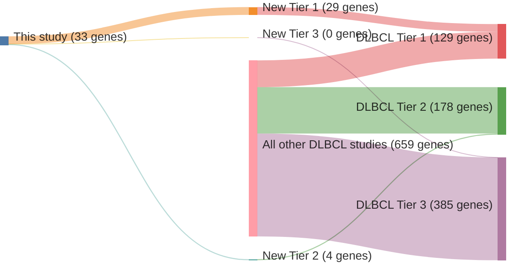

# @morinFrequentMutationHistonemodifying2011
## Summary of novel genes

|Entity| Tier 1 genes| Tier 2 genes|Tier 3 genes|
|:-:|:-:|:-:|:-:|
|DLBCL|29|4|0|
|FL|21|4|0|

## Novel genes reported in this study

### Tier 1
|New gene|DLBCL tier|FL tier|
|:-|:-:|:-:|
|[B2M](../B2M)|1 |1 |
|[BCL10](../BCL10)|1 |2 |
|[BCL2](../BCL2)|1 |1 |
|[BCL6](../BCL6)|1 |1 |
|[BCL7A](../BCL7A)|1 |1 |
|[BTG1](../BTG1)|1 |1 |
|[BTG2](../BTG2)|1 |1 |
|[CARD11](../CARD11)|1 |1 |
|[CCND3](../CCND3)|1 |1 |
|[CD58](../CD58)|1 | |
|[CD70](../CD70)|1 |2 |
|[CD79B](../CD79B)|1 |2 |
|[ETS1](../ETS1)|1 | |
|[FOXO1](../FOXO1)|1 |1 |
|[GNA13](../GNA13)|1 |1 |
|[HIST1H1C](../HIST1H1C)|1 |1 |
|[IKZF3](../IKZF3)|1 | |
|[IRF4](../IRF4)|1 |1 |
|[IRF8](../IRF8)|1 |1 |
|[KLHL6](../KLHL6)|1 |1 |
|[KMT2D](../KMT2D)|1 |1 |
|[MEF2B](../MEF2B)|1 |1 |
|[S1PR2](../S1PR2)|1 |1 |
|[SGK1](../SGK1)|1 |1 |
|[SOCS1](../SOCS1)|1 |1 |
|[TMEM30A](../TMEM30A)|1 |2 |
|[TNFRSF14](../TNFRSF14)|1 |1 |
|[TP53](../TP53)|1 |1 |
|[ZFP36L1](../ZFP36L1)|1 | |

### Tier 2
|New gene|DLBCL tier|FL tier|
|:-|:-:|:-:|
|[CD274](../CD274)|2 | |
|[CIITA](../CIITA)|2 | |
|[FAT2](../FAT2)|2 | |
|[RAPGEF1](../RAPGEF1)|2 | |

# Details

