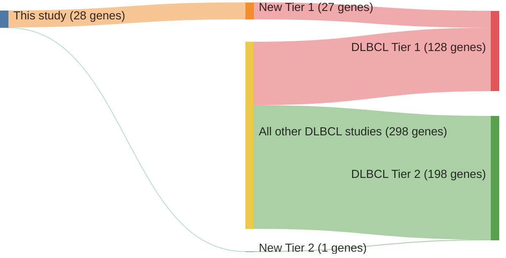

# @morinFrequentMutationHistonemodifying2011
## Summary of novel genes

|Entity| Tier 1 genes| Tier 2 genes|
|:-:|:-:|:-:|
|DLBCL|27|1|
|FL|19|4|

## Novel genes reported in this study

|New gene|DLBCL tier|FL tier|
|:-|:-:|:-:|
|[B2M](B2M)|1 |1 |
|[BCL10](BCL10)|1 |2 |
|[BCL2](BCL2)|1 |1 |
|[BCL6](BCL6)|1 |1 |
|[BTG1](BTG1)|1 |1 |
|[BTG2](BTG2)|1 |1 |
|[CARD11](CARD11)|1 |1 |
|[CCND3](CCND3)|1 |1 |
|[CD274](CD274)|2 | |
|[CD58](CD58)|1 | |
|[CD70](CD70)|1 |2 |
|[CD79B](CD79B)|1 |2 |
|[CIITA](CIITA)|1 | |
|[ETS1](ETS1)|1 | |
|[FOXO1](FOXO1)|1 |1 |
|[GNA13](GNA13)|1 |1 |
|[HIST1H1C](HIST1H1C)|1 |1 |
|[IRF4](IRF4)|1 |1 |
|[IRF8](IRF8)|1 |1 |
|[KLHL6](KLHL6)|1 |1 |
|[KMT2D](KMT2D)|1 |1 |
|[MEF2B](MEF2B)|1 |1 |
|[S1PR2](S1PR2)|1 |1 |
|[SGK1](SGK1)|1 |1 |
|[SOCS1](SOCS1)|1 |1 |
|[TMEM30A](TMEM30A)|1 |2 |
|[TP53](TP53)|1 |1 |
|[ZFP36L1](ZFP36L1)|1 | |

# Details

