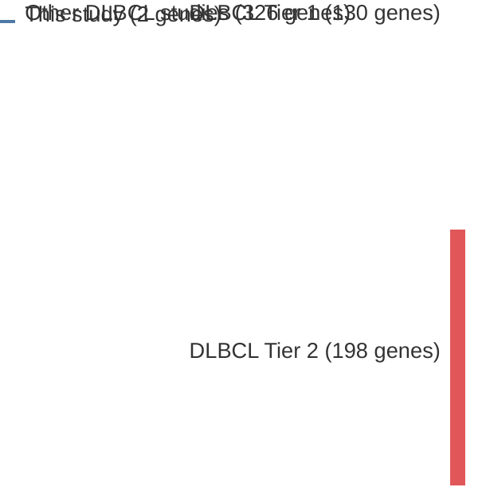

# @morinGeneticLandscapesRelapsed2016
## Summary of novel genes

|Entity| Tier 1 genes| Tier 2 genes|
|:-:|:-:|:-:|
|DLBCL|2||

## Novel genes reported in this study

|New gene|DLBCL tier|
|:-|:-:|
|[NFKBIE](NFKBIE)|1 |
|[NFKBIZ](NFKBIZ)|1 |

# Details

