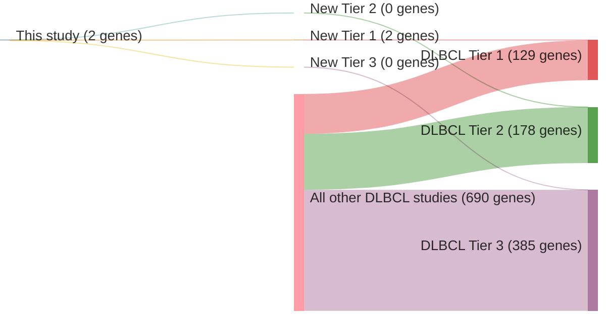

# @morinGeneticLandscapesRelapsed2016
## Summary of novel genes

|Entity| Tier 1 genes| Tier 2 genes|Tier 3 genes|
|:-:|:-:|:-:|:-:|
|DLBCL|2|0|0|

## Novel genes reported in this study

### Tier 1
|New gene|DLBCL tier|
|:-|:-:|
|[NFKBIE](../NFKBIE)|1 |
|[NFKBIZ](../NFKBIZ)|1 |

# Details

