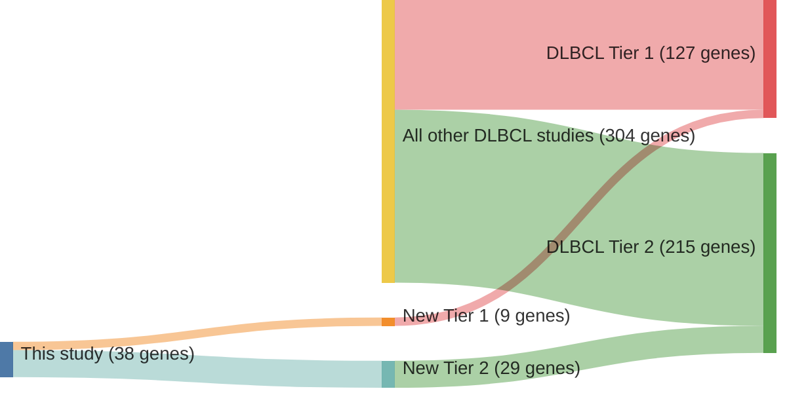

# @morinMutationalStructuralAnalysis2013
## Summary of novel genes

|Entity| Tier 1 genes| Tier 2 genes|
|:-:|:-:|:-:|
|DLBCL|9|29|

## Novel genes reported in this study

### Tier 1
|New gene|DLBCL tier|
|:-|:-:|
|[CD83](../CD83)|1 |
|[CDKN2A](../CDKN2A)|1 |
|[GNAI2](../GNAI2)|1 |
|[HIST1H1D](../HIST1H1D)|1 |
|[HIST1H2AC](../HIST1H2AC)|1 |
|[IKZF3](../IKZF3)|1 |
|[MPEG1](../MPEG1)|1 |
|[RB1](../RB1)|1 |
|[TAF1](../TAF1)|1 |

### Tier 2
|Novel Gene|BL tier|Average variant quality|QC outcome|
|:-|:-:|:-:|:-:|
|[ABI3BP](../ABI3BP)|2 |&starf; &starf; &starf; &star; &star;|**Pass**|
|[CDH9](../CDH9)|2 |&starf; &starf; &starf; &star; &star;|**Pass**|
|[CNTNAP5](../CNTNAP5)|2 |&starf; &starf; &starf; &starf; &star;|**Pass**|
|[DNAH5](../DNAH5)|2 |&starf; &starf; &starf; &starf; &star;|**Pass**|
|[DSG4](../DSG4)|2 |&starf; &starf; &starf; &star; &star;|**Pass**|
|[FAM38B](../FAM38B)|2 |&starf; &starf; &star; &star; &star;|**Fail**|
|[FAT4](../FAT4)|2 |||
|[FNDC1](../FNDC1)|2 |||
|[HDAC7](../HDAC7)|2 |||
|[HIST1H2AG](../HIST1H2AG)|2 |||
|[IER2](../IER2)|2 |||
|[IFNGR1](../IFNGR1)|2 |||
|[LRRN3](../LRRN3)|2 |||
|[MPDZ](../MPDZ)|2 |||
|[NLRP5](../NLRP5)|2 |||
|[ODZ3](../ODZ3)|2 |||
|[P2RX5](../P2RX5)|2 |||
|[PASK](../PASK)|2 |||
|[PCDHB11](../PCDHB11)|2 |
|[PDS5B](../PDS5B)|2 |
|[PKD1](../PKD1)|2 |
|[POGZ](../POGZ)|2 |
|[PRKCB](../PRKCB)|2 |
|[PTPN23](../PTPN23)|2 |
|[SAMD9L](../SAMD9L)|2 |
|[SARM1](../SARM1)|2 |
|[SRRM2](../SRRM2)|2 |
|[SYPL1](../SYPL1)|2 |
|[WDFY3](../WDFY3)|2 |

# Details

