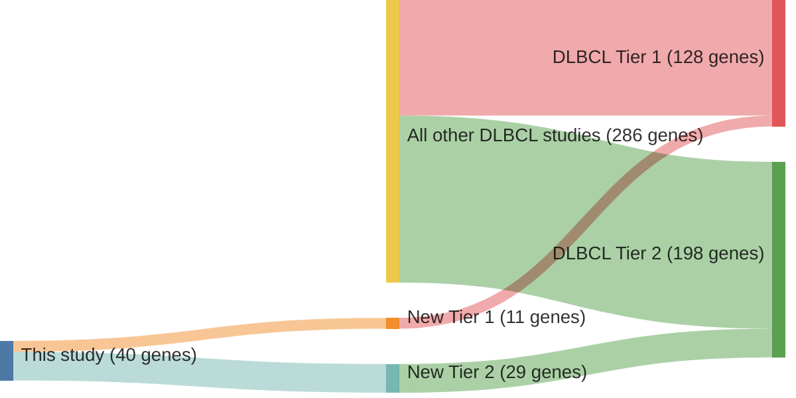

# @morinMutationalStructuralAnalysis2013
## Summary of novel genes

|Entity| Tier 1 genes| Tier 2 genes|
|:-:|:-:|:-:|
|DLBCL|11|29|

## Novel genes reported in this study

|New gene|DLBCL tier|
|:-|:-:|
|[ABI3BP](../ABI3BP)|2 |
|[CD83](../CD83)|1 |
|[CDH9](../CDH9)|2 |
|[CDKN2A](../CDKN2A)|1 |
|[CNTNAP5](../CNTNAP5)|2 |
|[DNAH5](../DNAH5)|2 |
|[DSG4](../DSG4)|2 |
|[DUSP2](../DUSP2)|1 |
|[FAM38B](../FAM38B)|2 |
|[FAT4](../FAT4)|2 |
|[FNDC1](../FNDC1)|2 |
|[GNAI2](../GNAI2)|1 |
|[HDAC7](../HDAC7)|2 |
|[HIST1H1D](../HIST1H1D)|1 |
|[HIST1H1E](../HIST1H1E)|1 |
|[HIST1H2AC](../HIST1H2AC)|1 |
|[HIST1H2AG](../HIST1H2AG)|2 |
|[IER2](../IER2)|2 |
|[IFNGR1](../IFNGR1)|2 |
|[IKZF3](../IKZF3)|1 |
|[LRRN3](../LRRN3)|2 |
|[MPDZ](../MPDZ)|2 |
|[MPEG1](../MPEG1)|1 |
|[NLRP5](../NLRP5)|2 |
|[ODZ3](../ODZ3)|2 |
|[P2RX5](../P2RX5)|2 |
|[PASK](../PASK)|2 |
|[PCDHB11](../PCDHB11)|2 |
|[PDS5B](../PDS5B)|2 |
|[PKD1](../PKD1)|2 |
|[POGZ](../POGZ)|2 |
|[PRKCB](../PRKCB)|2 |
|[PTPN23](../PTPN23)|2 |
|[RB1](../RB1)|1 |
|[SAMD9L](../SAMD9L)|2 |
|[SARM1](../SARM1)|2 |
|[SRRM2](../SRRM2)|2 |
|[SYPL1](../SYPL1)|2 |
|[TAF1](../TAF1)|1 |
|[WDFY3](../WDFY3)|2 |

# Details

