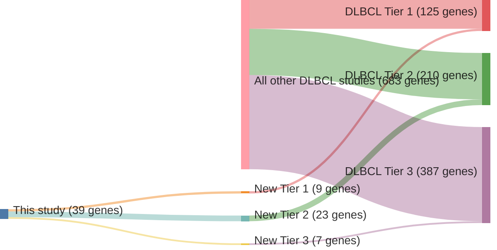

# @morinMutationalStructuralAnalysis2013
## Summary of novel genes

|Entity| Tier 1 genes| Tier 2 genes|Tier 3 genes|
|:-:|:-:|:-:|:-:|
|DLBCL|9|23|7|

## Novel genes reported in this study

### Tier 1
|New gene|DLBCL tier| Average variant quality | QC outcome |
|:-|:-:|:-:|:-:|
|[CD83](../CD83)|1 || |
|[CDKN2A](../CDKN2A)|1 || |
|[GNAI2](../GNAI2)|1 || |
|[HIST1H1D](../HIST1H1D)|1 || |
|[HIST1H2AC](../HIST1H2AC)|1 || |
|[MPEG1](../MPEG1)|1 || |
|[RB1](../RB1)|1 || |
|[TAF1](../TAF1)|1 || |
|[ZNF608](../ZNF608)|1 || |

### Tier 2
|New gene|DLBCL tier| Average variant quality | QC outcome |
|:-|:-:|:-:|:-:|
|[ABI3BP](../ABI3BP)|2 |&starf; &starf; &starf; &star; &star; |PASS |
|[ARAP2](../ARAP2)|2 || |
|[CDH9](../CDH9)|2 |&starf; &starf; &starf; &star; &star; |PASS |
|[CNTNAP5](../CNTNAP5)|2 |&starf; &starf; &starf; &starf; &star; |PASS |
|[DNAH5](../DNAH5)|2 |&starf; &starf; &starf; &starf; &star; |PASS |
|[DSEL](../DSEL)|2 || |
|[DSG4](../DSG4)|2 |&starf; &starf; &starf; &star; &star; |PASS |
|[FAT4](../FAT4)|2 |&starf; &starf; &starf; &star; &star; |PASS |
|[HDAC7](../HDAC7)|2 |&starf; &starf; &starf; &star; &star; |PASS |
|[HIST1H2AG](../HIST1H2AG)|2 |&starf; &starf; &starf; &star; &star; |PASS |
|[IFNGR1](../IFNGR1)|2 |&starf; &starf; &starf; &starf; &star; |PASS |
|[MPDZ](../MPDZ)|2 |&starf; &starf; &starf; &starf; &star; |PASS |
|[NLRP5](../NLRP5)|2 |&starf; &starf; &starf; &star; &star; |PASS |
|[ODZ2](../ODZ2)|2 |&starf; &starf; &starf; &star; &star; |PASS |
|[P2RX5](../P2RX5)|2 |&starf; &starf; &starf; &star; &star; |PASS |
|[PASK](../PASK)|2 |&starf; &starf; &starf; &starf; &star; |PASS |
|[PCDHB11](../PCDHB11)|2 |&starf; &starf; &starf; &star; &star; |PASS |
|[PDS5B](../PDS5B)|2 |&starf; &starf; &starf; &starf; &star; |PASS |
|[PRKCB](../PRKCB)|2 |&starf; &starf; &starf; &starf; &star; |PASS |
|[SAMD9L](../SAMD9L)|2 |&starf; &starf; &starf; &star; &star; |PASS |
|[SRRM2](../SRRM2)|2 |&starf; &starf; &starf; &star; &star; |PASS |
|[SYPL1](../SYPL1)|2 |&starf; &starf; &starf; &star; &star; |PASS |
|[WDFY3](../WDFY3)|2 |&starf; &starf; &starf; &starf; &star; |PASS |

### Tier 3
|New gene|DLBCL tier| Average variant quality | QC outcome |
|:-|:-:|:-:|:-:|
|[FAM38B](../FAM38B)|3 |&starf; &starf; &star; &star; &star; |FAIL |
|[FNDC1](../FNDC1)|3 |&starf; &starf; &star; &star; &star; |FAIL |
|[IER2](../IER2)|3 |&starf; &star; &star; &star; &star; |FAIL |
|[PKD1](../PKD1)|3 |&starf; &starf; &star; &star; &star; |FAIL |
|[POGZ](../POGZ)|3 |&starf; &starf; &star; &star; &star; |FAIL |
|[PTPN23](../PTPN23)|3 |&starf; &starf; &star; &star; &star; |FAIL |
|[SARM1](../SARM1)|3 |&starf; &starf; &star; &star; &star; |FAIL |

# Details

